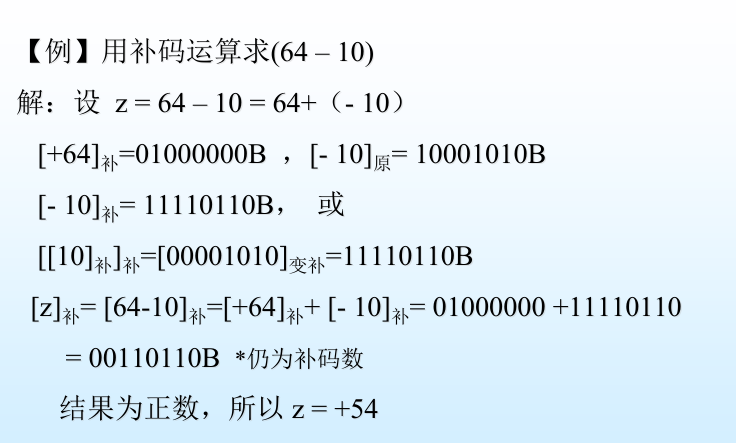

## 1. 数制

### 1.1 常用计数制

十进制、二进制、八进制、十六进制

二-十进制数（BCD Binary coded Decimal）

用**4位二进制码**表示1位十进 制数。最常用的是**8421编码**。

- 压缩BCD码：每一位十进制数用4**位二进制数**来表示
- 非压缩BCD码：每一位十进制数用8**位二进制数**来表示

### 1.2 计数制的书写规则

- 加英文字母： 1001B, 3456Q, 10FAH, 3578D
- 括号外加下标：(1001) 2, (1001) 8 , (2DF2) 16
- 为任何标注默认为十进制数

### 1.3 数制转换

- k进制转十进制：按权展开相加
- 十进制转k进制：
  - 整数：除k取余法
  - 小数：乘k取整法

### 1.4 码制

#### (1).基本概念

- 真值数：“+/-”表示数正负的数
- 机器数：用符号位上的0、1来表示数的正负

#### (2)分类

- 无符号数：数值范围 $0 ~ 2^n$
- 有符号数：
  - 原码
  - 反码
  - 补码
  - 移码

#### (3) 原码、反码、补码转换

-  当X为正数时 :
   -  [X]原=[X]反=[X]补

- 当X为负数时:
  - [X]反是将[X]原符号位不变 ,其余各位取反
  - [X]补是将[X]原符号位不变 ,其余各位取反再加1

#### (4) 移码

在补码表示的基础上通过**将符号位取反**来获得

### 1.5 进位和溢出

- 进位：最高位向更高为的进位， 被运算器丢弃，保存在进位标志触发器中（CF）
  - 无符号数：不统计在运算结果中
  - 有符号数：进位值是结果的一部分
- 溢出：结果超出了寄存器的表示范围，溢出触发器（OF）置1

- 溢出判断
  - 有符号数：看CS（符号位）和CP位（数值最高位）。异或值为1则溢出。

### 1.6 整数补码运算

**模**

模是计算器的最大容器，模运算中，超过部分被运算器自动“丢弃”。

