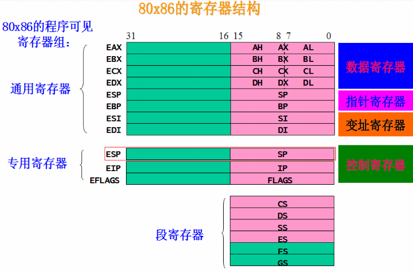
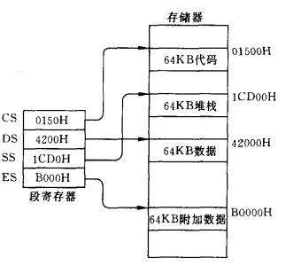
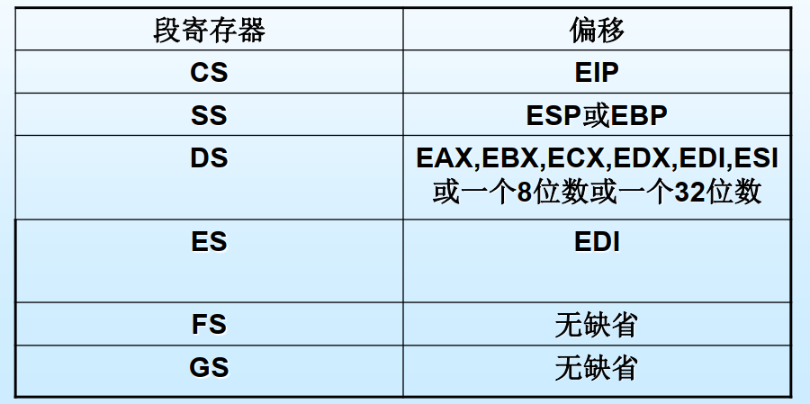
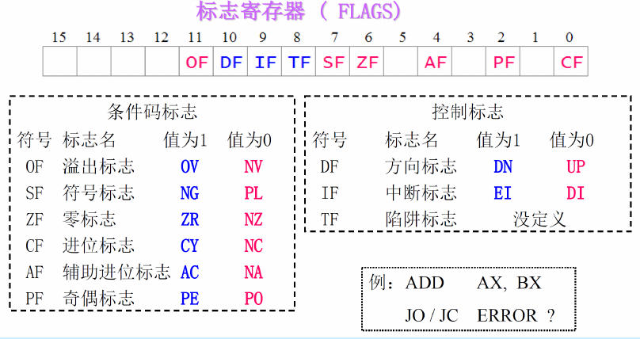
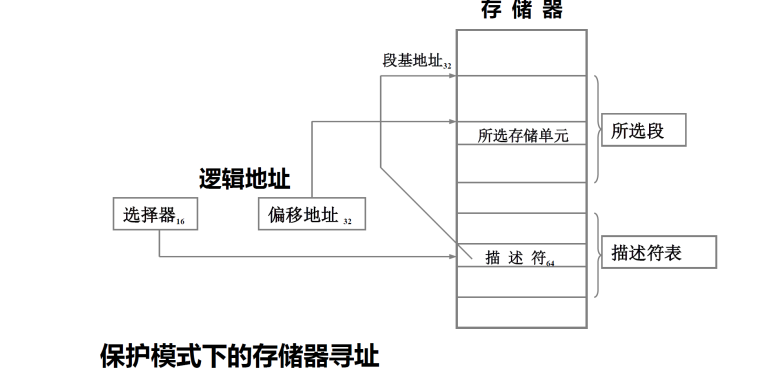

## 1. 冯诺依曼结构

- 存储器：存储指令和数据
- 运算器（ALU）：算术运算和逻辑运算
- 控制器：译码指令，产生控制信号
- 输入设备
- 输出设备

## 2. 微型计算机

硬件组成

- 微处理机（CPU）
- 内存处理器（按存储方式）
  - ROM
  - RAM
- 输入/输出接口电路
  - 连接外围设备和计算机的电路，进行信息交换
  - 作用：暂存、缓冲、类型转换、时许匹配
- 总线
  - CPU与其他部件之间的信息传输通道
  - 按照信息的不同类型
    - 数据总线（DB Data Bus）
    - 地址总线（AB  Address Bus）

## 3. 80486 微处理器

### 3.1 80486 内部结构

**7大部分**

- 总线接口部分：产生访问存储器和I/O借口所需的地址、数据和命令
- 指令预存部件：两个16字节的队列寄存器，每次最多从Cache中读取16字节的信息
- 译码部件：对指令的操作码进行译码，将翻译结果通过指令总线送到控制部件
- 控制部件：产生**微指令**， 对运算部件、存储管理部件和指令译码器发出**控制信号**
- 运算部件：
  - 定点运算部件：算数逻辑单元ALU、移位器、寄存器组
  - 浮点运算部件：浮点运算单元FPU、浮点寄存器组
- 存储管理部分：为了实现**虚拟存储器**
  - 分段部件：管理逻辑地址空间（46位），把**逻辑地址转换成32位的线性地址**
  - 分页部件：把**线性地址转换位物理地址（32位）**
- 高速缓冲存储器（Cache）：
  - 作用：**加速指令和数据的访问过程**
  - 大小：8KB
  - 原理：存储最近运行程序所需的代码和数据

### 3.2 寄存器组:star:

- 基本结构寄存器
- 系统级寄存器
- 浮点寄存器
- 调试和测试寄存器

基本结构寄存器可以分为

- 通用寄存器
- 段寄存器
- 指令指针寄存器
- 标志寄存器

#### 3.2.1 通用寄存器

- 通用寄存器——用于存放数据或地址,可进行32位、16位、8位、1位运算。
- 8个32位的:EAX,EBX,ECX,EDX,ESI,EDI,EBP,ESP。
- 其低16位可独立使用,称:AX,BX,CX,DX,SI,DI,BP,SP。
- 可作为8位寄存器使用是:AH,AL,BH,BL,CH,CL,DH,DL。

#### 3.2.2 通用寄存器介绍

数据寄存器：AX、DX、CX、DX是数据寄存器，可以通过16位或8位的形式访问。

- AX（累加器）
  - **算术运算**的主要寄存器
  - 存放操作数
  - I/O指令中与外部设备传输数据
- BX（基址寄存器）
  - 通用+基址寄存
- CX（计数器）
  - **移位指令、循环指令和串处理指令中**用作隐含的计数器
- DX（数据寄存器）
  - **DX+AX存放双字节数， DX存放双字的高位字**
  - I/O操作中存放端口地址

指针变址寄存器：SP、BP、SI、DI， 也可以存放操作数，只能以16位形式访问。

- SP（堆栈指针寄存器）
  
  - BP指示基地址，SP指示段顶的偏移地址，表示堆栈的栈顶的偏移地址
- BP（基址指针寄存器）
  
  - 与SS寄存器联用，表示堆栈中的任一字单元的偏移地址
- SI （源变址寄存器）
  
  - 与DS寄存器联用，用来确定数据段中某一存储单元的地址
  - 串处理中，作为隐含的源变址寄存器
- DI（目的变址寄存器）
  - 与DS寄存器联用，在数据段中寻址
  
  - 与附加段ES联用，在附加段中寻址
  
  - SI， DI有自动增减量的功能
  
  - 串处理中，作为隐含的目的变址寄存器
  
    

#### 3.2.3  段寄存器
段寄存器专用于存储器寻址。

有6个16位段寄存器:

- CS（代码段寄存器）
  - 存放程序段的**基地址**， 要执行的指令代码均存放在当前代码段中
- DS（数据段寄存器）
  - 存放指定数据段的**基地址**， 指令中所需操作数常放于当前数据段
  - 使用串处理指令，源操作数存放在DS中。
- SS（堆栈段寄存器）
  - 提供对堆栈段的基地址，堆栈操作所处理的数据均放在当前堆栈段中
- ES， FS， GS（附加段）：
  - 存放当前附加段的基地址， 附加段通常也用来存放存储器操作数
  - 使用串处理指令，源操作数也可存放在附加段中

80X86中，段寄存器和与其对应存放偏移地址的寄存器之间的缺省组合关系

#### 3.2.4 指令指针（IP/EIP）
- 存放**相对于代码段基址的偏移量**
- 在程序执行过程中，**始终指向下一条指令的首地址**
- 与CS联用确定下一条指令的物理地址
- 32位的寄存器， 称EIP；其低16位可独立使用，称IP
- **计算机就是使用CS和IP来控制指令序列的执行流程的.**

#### 3.2.5  标志寄存器

- 进位/借位标志（CF Carry Flag）
  - 主要用于多字节的加减
  - 最高位有进位则CF置为1，反之为0
  - 移位和循环也影响CF
- 奇偶标志（PF Parity Flag）
  - 算术或逻辑运算结果**低8位**中1的个数的奇偶
  - 偶数个1，PF=1；奇数个1，PF=0
  - 奇偶标志位用于检查数据在传输过程是否出错
- 辅助进位/借位标志（AF Auxiliary Flag）
  - 加减运算中，AF反映了**最低4位**向高位是否产生了进位
- 零标志（ZF Zero Flag）
  - 操作结果位0，ZF=1；反之ZF=0
- 符号标志（SF， Signal Flag）
  - SF为1，表示数据的最高位（符号位）为1
- 溢出标志（OF Overflow Flag）
  - OF为1， 表示运算结果产生溢出
  - 如果定义操作数是**有符号数**，测试OF，若为1，则表示溢出
  - 如果定义操作数是**无符号数**，测试CF，若为1， 则表示溢出。

- 方向标志（DF）
  - 串处理中，控制字符串操作指令中地址变化的方向
  - 指令`STD`：D置为1，串指针(SI/DI)自动减量，即减址调整
  - 指令`CLD`：D置为0， 串指针(SI/DI)自动增量，即增址调整

- 中断允许标志（IF）
  - 控制CPU是否响应**外部可屏蔽中断请求（INTR）**
  - I标志不影响外部**非屏蔽中断(NMI)**或内部中断
  - 执行STI指令，I标志置为1，CPU响应可屏蔽中断
  - 执行CLI指令，I标志置为0，CPU不响应可屏蔽中断
- 陷阱标志（TF）
  - 用于单步调试程序
  - T为1，CPU每执行一条指令后都产生一个内部中断
  - T为0，CPU连续执行指令

## 4. 存储器

### 4.1 基本单位

- 位:一位二进制数
- 字节:八位二进制数
- 字:二个相邻字节组成的16位二进制数
- 双字:四个相邻字节组成的32位二进制数

- 1Byte=8bits
- 1Word=2Bytes=16bits
-  1Dword=2Words=4Bytes=32Bits

### 4.2 寻址

- 实模式
  - 16位段地址（左移4位）+16位地址偏移（20位物理地址）
  - 最大寻址空间1MB
- 保护模式
  - 16位段地址+16位地址偏移（32位物理地址）
  - 最大寻址空间4GB

## 5. 外设

外设与主机（CPU、存储器）的通信通过外设接口进行，每个接口包含一组寄存器。

- 数据寄存器：存放外设与主机传送的数据，起缓冲作用。
- 状态寄存器：保存外设或接口的状态信息，了解外设工作情况
- 命令寄存器：CPU给外设的控制命令通过此寄存器送给外设

使用外设，主要有两种方式（BIOS、DOS），都是系统编制的子程序。系统通过中断方式转入所需子程序执行，执行完后返回。

- BIOS（基本输入输出系统 Basic Input/Output System）
  - 存放在ROM中，更接近硬件
  - 语句要完成每一个直接命令或信息送达
- DOS（磁盘操作系统 Disk Operating System）
  - 操作系统DOS的一个组成部分，开机时由磁盘装入存储器
  - 可以多次调用BIOS完成更高级的功能
  - 用户应尽可能使用层次较高的DOS