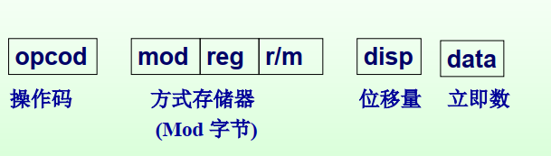
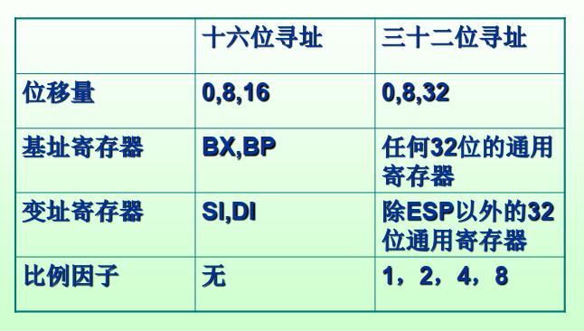
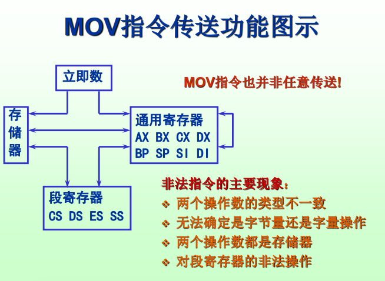
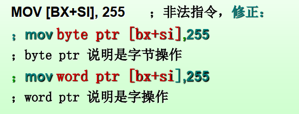
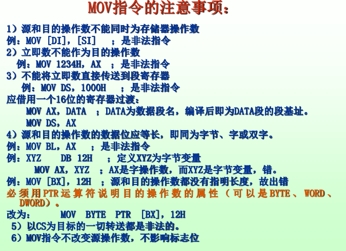
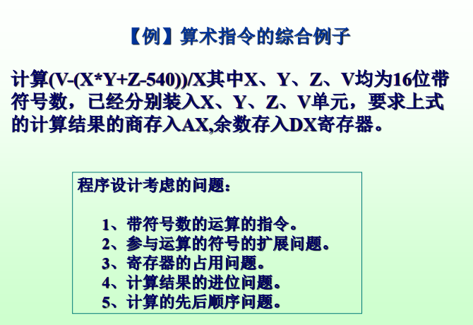
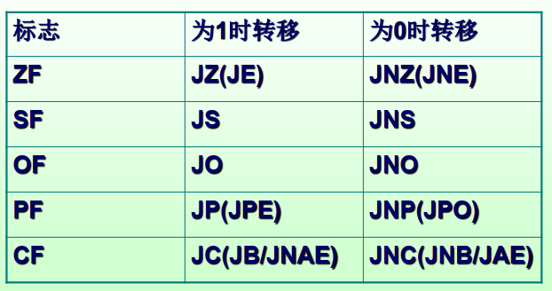
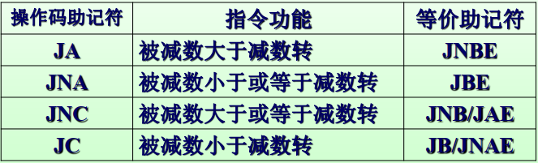
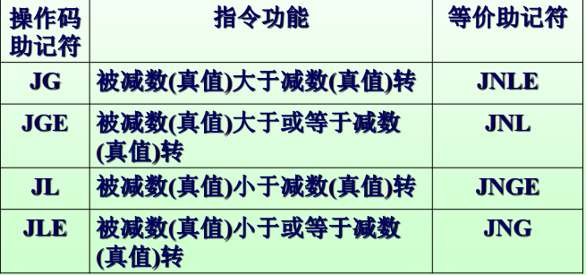

## 1. x86微处理器的指令格式

### 1.1 指令编码格式



### 1.2 指令书写格式

操作码+操作数

- 操作码（OP）：计算机要执行的操作
- 操作数（Operand）：指令的操作对象


#### 1.2.1 操作数

根据操作数存储位置分类

- 立即数：操作数存放在本条指令中
- 寄存器操作数：操作数存放在CPU的某个寄存器中
- 存储器操作数：操作数存放在存储器中


#### 1.2.2 指令类型

根据地址码的地址个数

- 零地址指令
- 一地址指令
- 二地址指令
- 三地址指令


## 2 x86处理器的寻址方式:star:

### 2.1 非存储器操作数寻址

- 立即寻址
  - 操作数直接存放在指令中，作为指令一部分存放在代码段中
  - 主要用来给寄存器或存储器赋初值
- 寄存器寻址
  - 操作数存放在通用寄存器中
  - 特点：运算速度快


### 2.2 存储器操作数寻址

#### 2.1 基本概念

- 操作数存放在内存某个单元中，用**主存地址**表示


- 80486采用**逻辑地址表示主存地址**

  - **段地址在默认的或着用段超越前缀指定的段寄存器中**
  - 指令中秩序给出操作数的**偏移地址（有效地址EA）**

- 有效地址（EA）：一个逻辑段中，某存储单元**相对于段首地址的地址位移量**

  - 组成成分：基址 + 变址*比例因子 + 位移量

  

#### 2.2 寻址方式

- 直接寻址
  - 有效地址在指令中直接给出
  - 默认段寄存器是**DS寄存器**， 可使用段超前前缀改变
  - 用中括号包含有效地址，表达存储单元内容
  - 两个操作数中必须有一个是寄存器
- 寄存器间接寻址
  - 有效地址=BX/BP/SI/DI＋ 8/16位位移量
  - 段地址对应BX/SI/DI寄存器默认是DS，对应BP寄存器默认是SS；可用段超越前缀改变
  - 要求事先把存储单元的有效地址写入规定的寄存器
- 寄存器相对寻址
  - 有效地址=BX/BP/SI/DI＋ 8/16位位移量
  - 段地址对应BX/SI/DI寄存器默认是DS，对应BP寄存器默认是SS；可用段超越前缀改变
- 基址变址寻址
  - 有效地址=BX/BP＋SI/DI（基址寄存器+变址寄存器）
  - 段地址对应BX基址寄存器默认是DS，对应BP基址寄存器
    默认是SS；可用段超越前缀改变
- 相对基址变址寻址
  - 有效地址＝ BX/BP＋ SI/DI＋ 8/16位位移量
  - 段地址对应BX基址寄存器默认是DS，对应BP基址寄存器默认是SS；可用段超越前缀改变


## 3. x86微处理器的指令系统

### 3.1 数据传送类指令

#### 3.1.1 通用数据传送指令

- mov

```assembly
mov dst, src
```

- 把一个字节或字的操作数从源地址传送至目的地址
- 立即数->寄存器或主存 `mov dx, 200h`
- 寄存器->（段）寄存器或主存 `mov ax, bx`
- 主存->（段）寄存器 `mov dx, [bp]`
- 段寄存器->寄存器或主存 `mov ax, ds`



**非法指令**

- 两个操作数不一致
- 两个操作数都是存储器（除了串操作，不允许两个操作数都是存储单元）
- 段寄存器的操作有一些限制
- 无法确定是字节量还是字量操作




**注意**



```assembly
movsx dst, src
;将SRC的符号位向高位扩展，使其与目标操作数字长相同，再送到DST，而SRC保持不变

movzx dst, src
;将SRC的高位用0补充，使其与目标操作数字长相同，再送到DST，而SRC保持不变。
```


```assembly
lea reg, src
```

- REG <- EA 把源操作数的有效地址送到指定的寄存器
- src 为内存操作数
- reg 为 16位或32位寄存器（除段寄存器外）


```assembly
lds/les/lfs/lgs/lss reg, src
;将源操作数高16位送隐含的目标寄存器
```


```assembly
lahf
```

- 标志寄存器传送指令
- 将标志寄存器低8位送ah指令


```assembly
sahf
```

- （ PSW的低位字节）<-  (AH)


```assembly
xchg OPR1, OPR2
```

- (OPR1 ) <=> (OPR2)
- OPR1与OPR2须是等长操作数, 且PR1,OPR2必须有一个是寄存器
- 执行结果不影响标志位
- 段寄存器不能作为xchg的操作数


```assembly
bswap reg32
```

- 字节交换指令
- 将32位REG的位31～位24与 位7～位0交换，位23～位16与位15～位8交换


```assembly
xlat table_name
```

- 查表指令（换码）
- 把一种码转换为另一种代码
- 使用：
  - 建立表格，将表格首地址预先存入bx或edx
  - 将要转换的代码与表格首地址的偏移量存入al
  - 执行换码指令  `DS:[BX+AL]  -> AL`


#### 3.1.2 堆栈操作指令

```assembly
push src
```

- 进栈指令
- 执行时， 首先调整堆栈指针，然后把源操作数压栈
- 执行操作：
  - 16位：`(SP) <- (SP)-2   ((SP)+1,(SP)) <-(SRC)`
  - 32位：`(ESP) <- (ESP)-4 ((ESP)+3 ~ (ESP))<-(SRC)`

- 若操作数不是直接寻址，则必须用PTR运算符来说明其属性。 `PUSH WORD PTR [BX]`


```assembly
pop dst
```

- 出栈指令
- 先将栈顶弹出2个或4个字节，送目标操作数，然后调整堆栈指针。
- 执行操作
  - 16位：`((SP)+1,(SP)) ->(DST) (SP) <-(SP) + 2`
  - 32位：`(ESP)+3~(SP)) -> (DST) (ESP) <- (ESP) +4`
- 例：` POP WORD PTR [BX]`


**堆栈操作特点**

- 堆栈操作的单位是**字**
- 堆栈空间：栈底（高地址单元）、栈顶（低地址单元）
- 栈底固定不变，栈顶随数据进出栈变化，通常用SP来指出栈顶的地址
- 字量数据压栈出栈时，都是低地址字节送低字节，高地址字节送高字节
- 堆栈操作遵循先进后出，但可用存储器寻址方式随机存取堆栈的数据
- 堆栈段作用：
  - 临时存放数据
  - 传递参数
  - 保存和恢复寄存器


```assembly
pushf ; flags标志位入栈

popf ;flags标志位出栈

pushfd ; flags标志位入栈

popdf ; eflags 出栈

pusha ; 16位通用寄存器入栈

popa ; 16位通用寄存器出栈

pushd ; 32位通用寄存器入栈

popad ; 32位通用寄存器出栈
```


### 3.2 算术运算类指令

```assembly
; 加法
add dest, src ; dest <- dest + src
adc dest, src; desc <- dest + src + CF
inc reg/mem; reg/mem <- reg/mem + 1
```

```assembly
; 减法
sub dest, src ; dest <- dest - src
sbb dest, src ; dest <- dest - src - CF
dec reg/mem ; reg/mem <- reg/mem - 1
neg reg/mem ; reg/mem <- 0－ reg/mem
```


```assembly
cmp dst, src ; dst - src
```

- 执行的结果不回送DST, 而是根据结果去影响标志位：
  CF、 OF、 SF、 ZF、 PF、 AF
- CMP常用于转移指令之前


```assembly
cmpxchg dst, src; 
```

- 比较并交换指令
- 将DST与AL/AX/EAX比较， 相等,则将SRC送DST;若不等,则将DST送AL/AX/EAX


```assembly
mul src ; 无符号乘法
```

- 乘数和被乘数必须是等长的无符号二进制数，乘积为双倍长
- **被乘数默认保存在累加器中（AL/AX/EAX）**
- 执行操作
  - 字节操作：(AX) <- (AL) * (SRC)
  - 字操作：(DX,AX) <- (AX) * (SRC)
  - 双字操作：(EDX,EAX) <- (EAX) * (SRC)
- 目标操作数必须是累加器AL、AX、EAX， 源操作数是除立即数之外的寻址方式
- 影响CF、OF标志位


```assembly
imul ; 带符号乘法
```

- 影响标志位：CF、OF
- 如果乘积的高一半是低一半的符号扩展则CF=OF = 0，否则 CF = OF = 1
- 执行操作：同无符号乘法
- 目标操作数必须是累加器AL、AX、EAX， 源操作数是除立即数之外的寻址方式


```assembly
div src
```

- 被除数应是除数的双倍字长，被除数放在默认寄存器
- 操作：
  - 字节操作：
    - 16 位被除数放在AX中， 8位除数为源操作数
    - 结果的8位商在AL中， 8位的余数在AH中
  - 字操作：
    - 32 位被除数在DX,AX中， 16位除数为源操作数
    - 结果的16位商在AX中， 16位的余数在DX中
  - 双字操作：
    - 64 位被除数在EDX,EAX中， 32位除数为源操作数
    - 结果的32位商在EAX中， 32位的余数在EDX中
- 执行DIV，运算后对标志位无确定影响，都没有意义
- 商超过规定的范围， 去执行0型中断


```assembly
idiv src ;
```

- 与DIV相同，但除数、被除数和商值都是有符号补码数
- 若被除数与除数等长时， 须先将被除数扩展。数的大小不变， 仅将数的符号位扩展。
- 操作：同 `div`


符号拓展指令

```assembly
cbw ; 字节->字，将AL的符号位拓展到AH

cwd ; 字->双字，将AX的符号位拓展到DX

cdq ; 双字->四字，EAX的符号位拓展到EDX

```



```assembly
; X * Y 字操作：(DX,AX) <- (AX) * (SRC)
mov ax, X
imul Y ;
mov cx, ax
mov bx, dx

; +Z
mov ax, Z
cwd ; 字->双字，将AX的符号位拓展到DX
add cx, ax ; 
adc bx, dx ; 

; - 540
sub cx, 540 ;
sbb bx, 0 ;

; V - 
mov ax, V
cwd
sub ax, cx
sub dx, bx
div x
; 32 位被除数在DX,AX中， 16位除数为源操作数
; 结果的16位商在AX中， 16位的余数在DX中
```


BCD码调整依据

- 出现非法编码
- AF=1 or CF=1

```assembly
daa 
```

- 压缩BCD码加法调整指令
- 针对AL中的两个组合十进制数之和进行修改，得到正确的组合十进制数
- 使用这条指令之前必须执行ADD或ADC指令将两个压缩的BCD码相加，并且把结果存放在AL寄存器中
- 调整方法：
  - 如果AF=1或AL的低四位大于9，则AL的寄存器内容加06H且使AF = 1
  - 如果CF=1或AL的高四位大于9 ，则AH的寄存器内容加60H且使CF = 1
  - DAA 执行后影响A、 C、 P、 S、 Z标志， 对OF未定义


```assembly
das 
```

- DAS压缩BCD码减法调整指令

- 针对AL中两个组合BCD之差进行修改，得到正确的组合十进制数表示的差值

- 使用这条指令之前必须执行SUB或SBB指令将两个压缩的BCD码
  相减，并且把结果存放在AL寄存器中

- 调整方法：

  - 如果AF=1 或者AL的低四位大于9，则AL的寄存器内容减06H且AF=1
  - 如果CF=1 或者AL的高四位大于9 ，则AH的寄存器内容减60H且CF=1
  - DAS执行后，影响A、 C、 P、 S、 Z标志位，对OF无定义

  

```assembly
aaa
```

- 未组合十进制加法调整指令
- 将存放在AL中的二个未组合十进制数之和进行调整， 从而在AH中得到十位的BCD码， AL中得到个位BCD码
- AAA一般紧跟在ADD或ADC之后， 影响标志A， C


```assembly
aas ; 未组合十进制数减法调整指令
aam ; 未组合十进制数乘法调整指令
aad ; 未组合十进制数除之前调整指令

```


### 3.3 转移和调用指令

用于控制指令流程的指令：

- 转移
- 循环
- 过程调用
- 中断调用

按转移条件分： 

- 无条件转移

- 有条件转移

按转移的范围分：
- 段内转移
- 段间转移

按获取地址的方法分：
- 直接转移和
- 间接转移


#### 3.3.1 无条件转移指令

```assembly
jmp
```

- 无条件转移指令

- 功能:

  - 执行指定标号处的指令
  - 执行结果不影响标志位

  

**转移地址寻址方式**

CS:IP 控制程序执行顺序

- 段内转移，指令只修改IP内容
- 段间转移，指令须修改CS、 IP内容


```assembly
; 段内直接转移
jmp 标号
jmp short 标号
```

- short：指令偏移量为8位，允许转移值的范围为－ 128～+127
- 不含SHORT的指令，其转移范围可覆盖整个逻辑段


```assembly
; 段内间接转移
jmp 寄存器操作数 ; IP <- (EA)
jmp 内存操作数
```

- 寄存器、 内存单元存放的是有效地址
- 间接是指当CPU执行指令时, 将寄存器或内存单元内的有效地址写入IP或EIP, 从而实现转移


```assembly
; 段间直接转移
jmp 标号
; IP <- 跳转的EA
; CS <- 跳转的段地址
```

- 模块化程序设计中, 从一个模块转移到另一个模块需执行段间转移指令


```assembly
; 段间间接转移
jmp 内存操作数 
; IP <- （EA）
; CS <- （EA+2）
```

- 在实模式下，段间间接转移指令将段地址和偏移地址送给CS和IP


#### 3.3.2 条件转移指令

- 按标志位当前状态转移
- 无符号数条件转移 （ “ A” 、“ B” ）
- 有符号数条件转移 （“ G” 、“ L” ）
- 循环控制转移

##### （1）判断单个标志的条件转移指令




#####  (2) 判断无符号数大小的条件转移指令

A:大于, B:小于, E:等于



 

##### （ 3）判断有符号数大小的条件转移指令

G:大于, L:小于, E:等于




#### 3.3.3 循环控制指令

```assembly
loop ; cx -1 -> cx， 若 cx ≠ 0， 转

LOOPZ ; CX-1 -> CX,若CX≠0且ZF=1,转

LOOPNZ ;CX-1 -> CX,若CX≠0且ZF=0,转
```

【例】编程实现:找出以ARRAY为首地址的100个字数组中的第一个非0项,送AX中。

```assembly
DS:
	array dw 0, 0, 0, 1010H, .... ; 初始化100个数
	
CS:
	; 初始化DS
	mov cx, 64H
	lea bx, array
	mov si, 0FFFEH ; -2，获得第一个数据
	
ZERO:
	inc si
	inc si
	cmp word ptr [bx + si], 0
	loopz ZERO ;判断CX≠0,且ZF=1,转
	mov ax, [bx+si]
```


### 3.4. 子程序调用和返回指令

#### 3.4.1 子程序调用与返回

- 子程序是一个**完整的、独立的有一定名称(标号)的程序段**
- 主程序调用子程序用子程序调用指令**CALL**实现;子程序结束须用一条返回指令(eg. **RET**指令),返回到主程序
  - CPU在读取CALL指令时，IP自动递增，使它指向下一条指令的存储单元地址
  - CALL指令执行时，必须保存CALL指令后面的第一条指令地址(断点地址)。

```assembly
call
```

-  须先将断点地址 IP或 CS与IP压栈,然后将子程序首地址送IP或CS与IP中, 从而将程序转到子程序入口,再顺序执行子程序。

```assembly
ret 
```

- 返回指令RET在子程序最后, CPU执行返回指令时,会从堆栈中弹出断点地址, 重新装入IP 或IP 与 CS中,从而返回主程序。

**子程序调用指令**

- 段内直接调用
- 段内间接调用
- 段间直接调用
- 段间间接调用


```assembly
int ; 中断调用指令

iret ; 中断返回指令

```


### 3.5 逻辑运算和移位指令

#### 3.5.1 逻辑运算指令

```assembly
not ; 取反
and ; 与
or ; 或
xor ; 异或
```


#### 3.5.2 移位指令

```assembly
sal 操作数,CL/立即数 ; 算术左移
shl 操作数,CL/立即数 ; 逻辑左移

sar 操作数,CL/立即数 ; 算术右移
shr 操作数,CL/立即数 ; 逻辑右移


rcl 操作数,CL/立即数 ; 含进位的循环左移
rcr 操作数,CL/立即数 ; 含进位的循环右移

rol 操作数,CL/立即数 ; 不含进位的循环左移
ror 操作数,CL/立即数 ; 不含进位的循环右移
```

例：

```assembly
sal al, 1
; al 的内容左移移位， D7位移进CF，末位补0；
; 内容乘2，若CF=1，则溢出

sar word ptr buf, 1
; buf中的双字节有符号数除以2，并取其整数

rol eax, 16 
; 高低16位的互换
```


#### 3.5.3 测试和位测试指令

（1）测试指令

```assembly
test dst, src
```

- src, dst 相与，结果不送回dst, 结果影响标志P、Z、S、Z，O、C置0
- 该指令后跟转移指令, 用来测试目标操作数的一位或某几位

（2）位测试指令

```assembly
bt ; 位测试
btr ; 位测试置0
bts ; 位测试置1
btc ; 位测试取反
```

- 四条指令相同点
  - 测试目中的由src指定的那一位,并将测试位位值送C标志
  - 若测试的位置大于目标操作数的长度,则取src/dst的余数才是测试位
  - 指令执行完后src不变
- 不同点：
  - bt执行后，dst不变
  - btr、bts、btc执行后对测试为做相应的操作，置0， 置1，取反


#### 3.5.4 位扫描指令

```assembly
bsf 
; 向前扫描 
; 从源的低位向高位搜索,将遇到第一个“1”所在的序号存入目标寄存器中

bsr 
; 向后扫描
; 从源的高位向低位搜索,将遇到第一个“1”所在的序号存入目标寄存器中

```


### 3.6 串操作指令

对数据块(字符串)进行操作, 其中部分指令可以两个操作数同时是存储器操作数

- 需要指明每次操作的类型
- 使用DS:SI(ESI)作为源操作数指针,可用段前缀指令改变；使用ES:DI(EDI)作为目的操作数指针,不能用段前缀指令改变
- 设置DF来表示每次操作以后变址寄存器SI和DI的变化方向：DF=0为增址方式,DF=1为减址方式
- CX存放要处理的字符串的元素个数
- 每处理完一个元素，自动修改SI、DI的值


#### 3.6.1 串传送指令

```assembly
movsb ; 字节传送
movsw ; 字传送
movsd ; 双字传送
movs oprd1, oprd2 ;
```

- CPU执行串传送指令,都是将源串DS:[SI]的一个字符元素送目标串ES:[DI]


#### 3.6.2 串装入指令

```assembly
lodsb ; DS:[SI]中的一个字节送AL
lodsw ; DS:[SI]中的一个字送AX
lodsd ; DS:[SI]中的一个双字送EAX
```

- 从源串取一个字符串元素送累加器


#### 3.6.3 串存储指令

```assembly
stosb ; 把 AL→ ES:[ DI]的1个单元
stosw ; 把 AX → ES:[ DI]的2个单元
stosd ; 把 EAX → ES:[ DI]的4个单元
```


#### 3.6.4 串比较指令

```assembly
cmps ;
cmpsb ; 字节比较
cmpsw ; 字比较
```


#### 3.6.5 串搜索指令

```assembly
scasb
scasw
scasd
```


#### 3.6.6 输入输出字符串

```assembly
insb
insw
insd
```

- 从DX指定端口输入一个字节,字或双字元素传送到ES:[DI]所指定的存储单元,同时自动修改目的指针

```assembly
outsb
outsw
outsd
```

- 把DS:[SI]所指定的存储单元一个字节,字或双字元素传送到DX指定端口,同时自动修改SI指针。


### 3.7 处理机控制指令

#### 3.7.1 标志位操作指令

```assembly
cmc ; CF 取反

stc ; CF <- 1
clc ; CF <- 0

std ; DF <- 1
cld ; DF <- 0

sti ; IF <- 0
cli ; IF <- 0
```


#### 3.7.2 外部同步指令

```assembly
nop 
; 空操作指令
; 常用于调试，修改程序

hlt
; 暂停指令
; 处理器停止工作,等到外部中断到来或复位信号,中断结束后继续向下执行,不影响标志位

wait
; 等待指令
; 处理器处于等待状态(TEST=1),每隔三个时钟周期对TEST=0,CPU退出等待,顺序执行下一条指令

lock ; 封锁总线指令

esc ; 处理器交权指令
```


#### 3.7.3 输入输出指令

```assembly
in al, dx ; 字节输入
in ax, dx ; 字输入
in eax, dx ; 双字输入
; DX端口号0000-FFFFH

out port, al ; 字节输出
out port, ax ; 字输出
out port, eax ; 双字输出
; port端口号00-FFH

```

 

#### 3.7.4 高级语言指令

```assembly
bound ; 数组边界检查
enter ; 设置堆栈空间指令
leave ; 撤销堆栈空间指令
```

