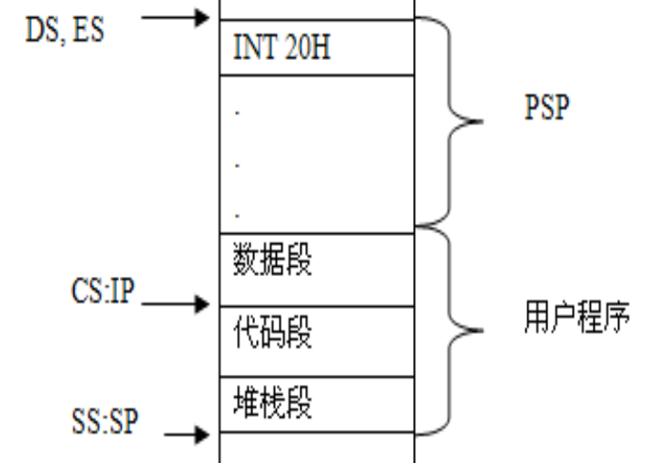
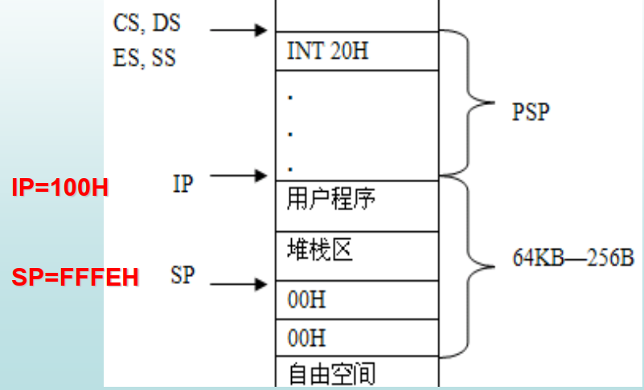
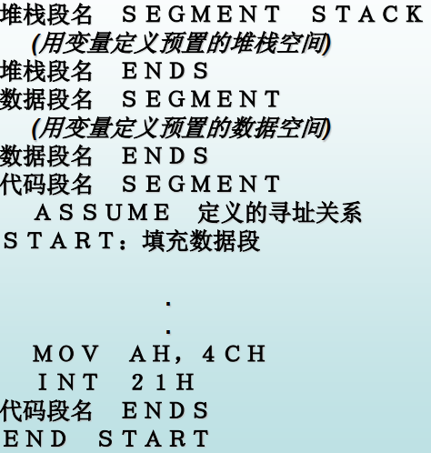
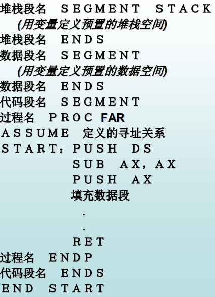

## 1. 汇编语言程序设计

### 1.1 EXE与COM文件编程格式

#### 1.1.1  EXE文件编程格式

- 源程序可使用多个逻辑段
- 实模式下，段大小<=64KB
- 适合编写大型程序

#### 1.1.2 COM文件编程格式

- 只有一个逻辑段，即代码段，不能设置堆栈段
- 数据可集中设置在段开始或结尾
- 启动指令在偏移地址100H的单元
- DOS调入COM文件后，自动初始化DS=CS
- 代码段长度<=64KB
- 适合编写中小型程序

### 1.2 EXE与COM文件的内存映像

#### 1.2.1 EXE文件内存映像

- 两部分：装入模块和重定位信息
  - DOS装入文件时两部分都调入内存
  - DOS根据重定位信息完成装入模块的重定位后就丢弃重定位信息
- 程序段前缀（PSP）
  - DOS在用户程序上方偏移地址为00~FFH的256字节的数据块

- CS:IP指向用户程序的启动指令所在的存储单元
- SS:SP指向用户堆栈段的栈顶（SS指向堆栈段的段基址）
- 自动给DS、 ES、 FS和GS赋值，使得DS=ES=PSP所在段的段基址， FS=GS=0。
- 计算机把控制权交给用户程序
- 在程序开始需重新给DS和ES赋初值



#### 1.2.2 COM文件内存映像

- 没有重定位信息，文件体积小
- 生成PSP
- 在偏移地址为100H的内存单元开始存放程序的第一条指令
- DOS自动使CS=DS=ES=SS=PSP所在段的段基址,FS=GS=0,且IP=100H,SP=FFFEH（SS:SP指向用户堆栈段的栈顶）
- 计算机把控制权交给用户程序




### 1.3 程序段点缀（PSP）

- 占256B，信息是DOS装载的可执行文件自动生成的
- 格式
  - PSP+00~01H       `INT 20H` 返回DOS
  - PSP+02~03H       可用内存的大小
  - PSP+80H              命令行参数的长度（不包括回车）
  - PSP+81～FFH     未格式化的命令行参数
- 每一个执行程序都要有PSP
- DOS通过PSP管理用户程序
- 程序返回DOS，程序和PSP所占的内存空间释放，还给DOS


### 1.4 返回DOS的其他方法

- 对EXE和DOS文件

  ```assembly
  MOV AH, 4CH
  
  INT 21H
  ```

- 另外三种方法

  - 直接调用 `INT 21H`
  - 调用 `INT 21H` 的0号功能
  - 执行 `RET` 功能（此时SP=FFFEH）

- EXE另一种方法

  - 设法修改CS： IP的值，让它们指向PSP中第一个存储单元开始存储的INT 20H指令
  
  ```assembly
  PUSH DS
  MOV AX,0
  PUSH AX
  ...
  ; 末尾
  RET
  ```
  
### 1.5 堆栈段设置
- COM只有代码段
- EXE堆栈段可有可无，不设置的话会自动分配一个含有128个字节的堆栈区

## 2. DOS系统的I/O调用

调用格式

```assembly
MOV AH,功能号
设置入口参数
INT 21H
分析出口参数
```

- 00H
  - 结束一个程序
  - 入口参数： CS＝程序段前缀段基址
- 01H
  - 等待从键盘上输入一个字符，有回显，响应[Ctrl-C](#ap1)
  - 出口参数： AL=按键的ASCII码
- 02H
  - 在显示器上显示一个字符，响应Ctrl-C
  - 入口参数： DL=等待显示字符的ASCII码
- 09H
  - 显示字符串，响应Ctrl-C
  - 入口参数： DS:DX=字符串首地址，字符串必须以字符‘ $’作为结束标志
- 0AH
  - 等待从键盘上输入一个字符串(必须以回车符表示结束)，然后存入内存中的数据缓冲区。有回显，响应Ctrl-C
  - 入口参数： DS:DX=数据缓冲区首地址， 首字节单元指出最大允许输入的字符串长度(包含回车符) 
  - 出口参数：在缓冲区第二个字节单元存放实际输入字符串的长度(不包含回车符)，从第三个字节开始存放实际的字符串,其中包含回车符的ASCII码0DH
- 4CH
  - 终止当前程序的运行，并把控制权交还给调用它的程序

## 3. BIOS键盘输入功能调用

### 3.1 调用格式

```assembly
MOV AH,功能号
设置入口参数
INT N
分析出口参数
```

### 3.2 调用

- INT 16H
  - BIOS键盘输入子功能
- INT 10H
  - BIOS屏幕操作功能

### 3.3 功能

- 00H
  - 读取键入的一个字符，无回显,响应Ctrl_C,无键入则等待
  - 出口参数： AL=键入字符的ASCII码，若AL=0，则AH=输入键的扩展码
- 01H
  - 查询键盘缓冲区
  - 出口参数：
    - ZF=0,表示有键入
      AL=键入字符的ASCII码
      AH＝键入字符的扩展码
    - ZF=1,表示无键入
- 02H
  - 读取当前转换键状态
  - 出口参数： AL=键盘状态字
- 10H
  - 读扩展键盘，无回显，响应CTRL+C
  - 出口参数： AL=键入字符的ASII码
    若AL=0,AH＝键入字符的扩展码
- 11H
  - 查询扩展键盘缓冲区
  - 出口参数：
    - ZF=0,表示有键入
      AL=键入字符的ASCII码
      AH＝ 键入字符的扩展码
    - ZF=1,表示无键入
- 12H
  - 读取扩展键盘的转换键状态
  - 出口参数： AL=扩展键盘状态字

### 3.4 汇编程序书写格式

#### 3.4.1 汇编程序书写格式1



#### 3.4.2 汇编程序书写格式2




## 4. 分支程序

- 单分支结构
- 复合分支结构
- 多分支结构

### 4.1 单分支结构

将BX寄存器的内容以二进制格式显示在屏幕上。

```assembly
;filename:651.asm
.486
code segment use16
	assume cs:code
beg:mov bx, 5678H
		mov cv, 16
		
last:mov dl, '0'
		rcl bx, 1
		jnc next
		mov dl, '1'
next:mov ah, 2
		int 21H
		loop last
		mov ah, 4CH
		int 21H
		
code ends
end beg
```

### 4.2 复合分支

设NUMBER单元的数X以及数值N1、 N2均为单字节无符号数，请判断X的大小，并根据判断结果分别显示： N1<=X<=N2,或X<N1,或X>N2

```assembly
.486
data segment use 16
	mesg1 db 'N1<=X<=N2$'
	mesg2 db 'X<N1'
	mesg3 db 'X>N2'
	number db ?
	N1 equ 22
	N2 equ 88
data ends

code segment use 16
	assume cs:code, ds:data
	beg:mov ax, data
			mov dx, ax
			mov dx, offset mesg1
			cmp number N1
			jnc next
			mov dx, offset mesg2
	next:cmp number N2
			jc disp
			mov dx, offset mesg3
	disp:mov ah, 9
			int 21H
			mov ah, 4CH
			int 21H
code ends
end beg
```


### 4.3 多分支结构

设计一个256分支的段内转移程序,设:JUMP单元有一个数X,
若X=0,转移到标号为P000的程序段;
若X=1,转移到标号为P001的程序段;
……
若X=255,转移到标号为P255的程序段;

```assembly
.486
data segment use 16
jump db ?
tab dw P000
		dw P001
		...
		dw P255
data ends		
code segment use 16
	assume cs:code, ds:data
beg:mov ax, data
		mov ds, ax 
		mov bl, jump
		mov bh, 0
		add bx, bx
		mov si offset tab
		jmp [bx+si]
		P000:...
		P001:...
		...
		P255:...
code ends
end beg
```


## 5. 循环程序设计

假设从BUF单元开始为一个ASCⅡ 码字符串,找出其中的最大数并送屏幕显示

```assembly
;method 1
.486
data segment use 16
	buf db 'QWERTYUIOP123'
	count equ $-buf; length of buf
	max db 'max=', ?, 0DH, 0AH, '$'
data ends

code segment use 16
	assume cs:code, ds:data
	beg:mov ax, data
			mov ds, ax
			mov al, 0; usingned number
			lea bx, buf
			mv cx, count
			
	last:cmp [bx], al
			jc next
			mov al, [bx]
	next:inc bx
			loop last
			
			mov max+4, al
			mov ah, 9
			mov dx, offset max
			int 21h
			mov ah 4CH
			int 21h
code ends
end beg
```

```assembly
;method 2
.486

```


## 附录

<span id='ap1'>Ctrl-C：DOS将自动调用INT
32H中断处理程序,从而强行使用户程序中断</span>

