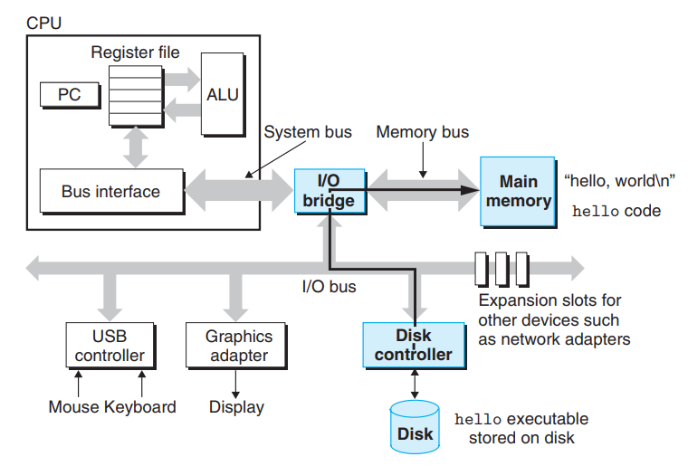
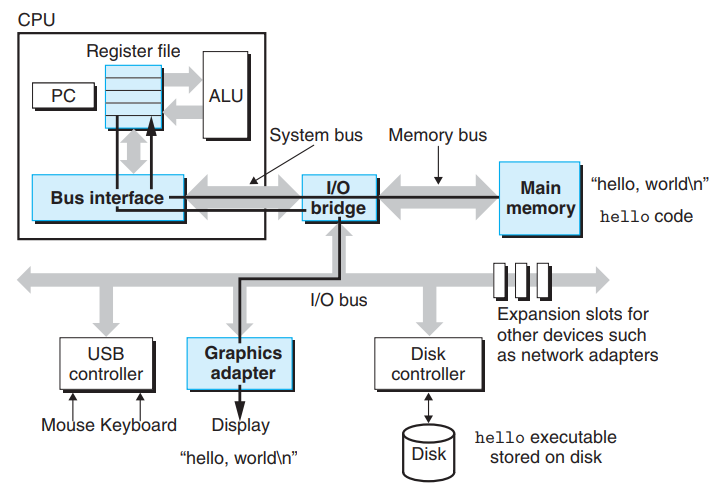

## 1. 数据的表示

所有的信息（代码和数据）在计算机中都以二进制的形式保存。数字有定点数和浮点数之分，有符号数和无符号数之分。字符以asicll码形式保存。

## 2. 程序代码转换过程

如下图，以`hello.c`为例

```c
# include<stdio.h>
int main(){
  printf("hello, world!\n");
  return 0;
}
```


1. 预处理：将以`#`开头的代码展开，gcc指令为 `gcc -o hello.i -E hello.c`， 在这个例子中，`#include<stdio.h>`将会展开。
2. 编译：通过编译器得到汇编代码，gcc指令为 `gcc -o hello.s -S hello.i`
3. 汇编：通过汇编器将汇编代码转化为二进制代码，即*可重定向目标程序*，gcc指令为 `gcc -o hello.o -c hello.s`，这个例子总，`hello.o` 即为*可重定向目标程序。
4. 链接：由于还需要调用C标准库的函数（`printf`），gcc链接的时候会引用`printf.o`，gcc指令为 `gcc  hello.o -o hello`，在shell中输入`./hello`即可运行程序。

以上就是C程序的代码转换过程，gcc也可以省略中间步骤一步转换，使用指令 `gcc  hello.c -o hello`。链接多个.o文件时，gcc指令为 `gcc test1.o test2.o -o test`，当文件结构复杂的时候采用make工具。


## 3. 硬件组成

计算机硬件的四大部分为IO设备、存储器、处理器、总线。


总线连接各个部件，传输以字为单位的数据。

IO设备通过通过控制器和适配器连接到IO总线，控制器是一块芯片组，适配器是连接主板的卡槽。

存储器从上到下包括cache、主存、本地磁盘、云存储。自上而下，速度越慢，价格越便宜，容量越大。cache由SRAM组成。主存在物理上由DRAM组成，逻辑上被看做是一个很大的线性数组。

处理器又称CPU，是计算机的核心硬件。PC（程序计数器 Program Counter）是一个特殊的寄存器，PC控制指令的执行顺序。ALU（运算逻辑单元 Arithmetic Logic Unit）负责各种运算，计算新的结果或地址。


## 4. 程序执行过程

下面以`hello`程序为例子


从键盘（IO设配）键入 `./hello`，通过总线将字符输送到 shell 程序，然后由shell程序去主存寻找`hello`程序。



主存没有找到，转而去磁盘中找，在DMA（直接内存访问 Direct Memory Access）的控制下，`hello`程序不经过CPU直接传输到主存。



程序加载到主存之后，处理器开始逐条执行程序的指令，并将结果输送的屏幕（IO设备）。


## 5. 操作系统如何管理硬件

操作系统（OS）两大职能：1保护硬件被不同进程混用；2.为程序提空简单、统一的方式来访问控制底层硬件。OS通过抽象（Abstraction）实现这些功能，如下图所示。<span style="color: red">文件是IO设备的抽象、虚拟内存是主存和磁盘IO设备的抽象、进程是处理器主存和IO设备的抽象。</span >


### 5.1 进程与线程

进程（process）从硬件角度来看是对处理器、内存以及IO设备的抽象，从软件角度来看是对运行中的程序的抽象。OS追踪进程所有的状态信息，以备运行之需，这些状态信息称为上下文（context）。当OS转而去处理另一个进程的时候，OS保存当前的上下文，加载新进程的上下文从而实现进程控制的切换。如下图展示了进程的切换。


提到了进程不得不提到线程（thread）。一个进程由多个执行单元组成，执行单元被称为线程。这些线程共享上下文、代码和全局数据。多个线程之间分享数据比多个进程之间更方便，因此在网络编程的并发中广泛应用。同时，由于线程通常比进程效率更高，在多内核的处理器中，多线程可以提高程序的运行速度。

### 5.2 虚拟内存

虚拟内存使得进程看起来是独占整个内存的。每个进程都有相同的内存视图，称为虚拟地址空间。Linux下的虚拟地址空间如下，地址顺序为自下而上。


- 程序数据和代码：保存程序的数据和代码。数据对应于C程序的全局变量。代码和数据根据可执行文件的上下文初始化。

- 堆：堆可以动态的伸缩，对应于C程序的malloc和free。

- 共享库：保存共享库的代码和数据，例如`stdio.h`、`math.h`

- 栈：栈也可以动态的伸缩，用于程序调用，函数调用则栈伸展、函数返回则栈收缩。
- 内核虚拟内存：这一块是常驻区域，保存内核。用户程序不能直接访问，必须通过调用内核才能访问。

### 5.3 文件

文件就是字节序列。

所有设备都可看成文件。


## 6. 并发和并行

<span style="color: red">并发（Concurrent）指系统中的多个活动同时发生，并行（Parallelism）指并发的使用使得系统运行更快。</span>

根据不同的层级可分为线程级并发、指令级并行、SIMD（单指令多数据 Single Instruction Muti Data）并行。

- 线程级并发：多个程序同时执行。能够实现单程序多用户，如多个用户同时访问同个网页。还能够实现多程序单用户，如一个用户打开多个程序。
- 指令级并行：多条指令同时执行。通过流水线技术实现。
- SIMD并行：一条指令执行多个操作。用于加速图像音频处理、向量操作等。


