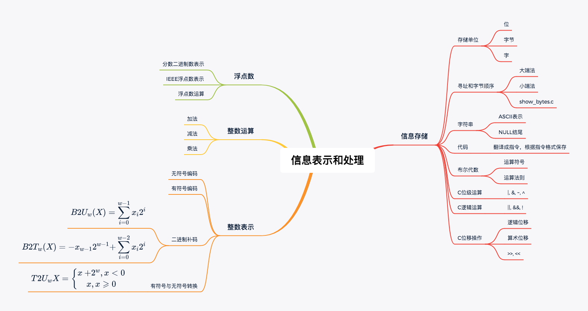
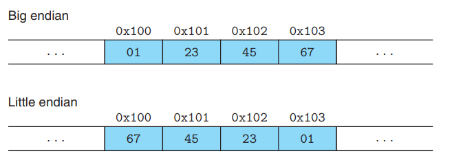
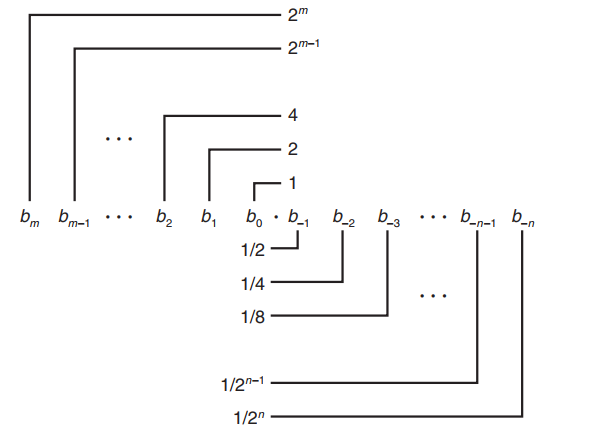
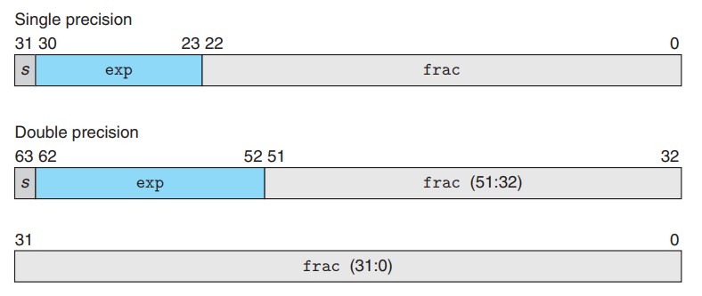
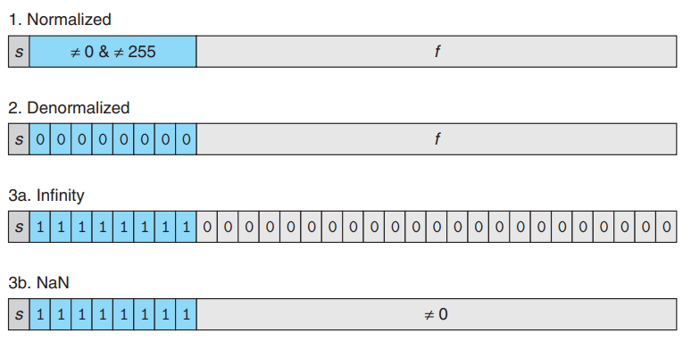
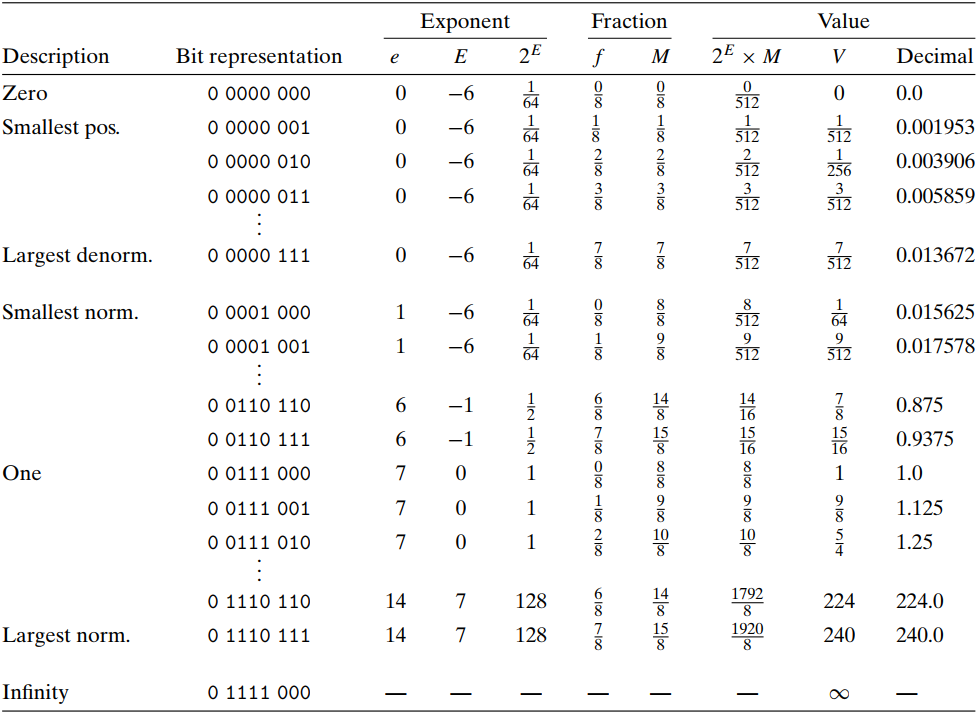

## 1. 信息存储

### 1.1存储单位

2字节=8位

32位机器为32字，64位机器为64字，字的大小决定了虚拟地址空间的大小。

### 1.2寻址和字节顺序

字节顺序分为大端法和小端法。

> 例：0x01234567
>
> 大端法：01 23 45 67 
>
> 小端法：67 45 23 01



下面的程序可以查看机器的字节顺序方式。

```c
typedef char* byte_pointer;
void show_bytes(byte_pointer p, int len){
  for(int i = 0; i < len; ++i)
    printf(" %.2x", p[i]);
  printf("\n");
}
```

测试上面的例子

```c
int x = 0x01234567;
show_bytes((byte_pointer) &x, sizeof(x));
```

在我的机器上结果为 ` 67 45 23 01`，根据结果可知字节顺序为小端法。


### 1.3 字符串

字符串的存储为，将字母通过ASCII码的形式存储，结尾为NULL。


### 1.4 代码

代码转换为指令，根据指令的格式来存储，通常不同的机器指令格式不同，所以代码的存储方式也不同。

### 1.5 C中的布尔代数

- 位级运算：`|, &, ~, ^`
- 逻辑运算：`||, &&, !`
- 位移操作：`<<， >>` 逻辑右移不带符号，算术右移带符号。


## 2. 整数表示

### 2.1 表示

无符号数
$$
B2U_w(X) = \sum_{i=0}^{w-1}x_i 2^i
$$
有符号数（二进制补码）
$$
B2T_w(X) = -x_{w-1}2^{w-1} + \sum_{i=0}^{w-2}x_i 2^i
$$

### 2.2 转换

有符号与无符号转换
$$
T2U_w{X} = \left\{\begin{matrix}
x + 2^w, x <  0\\ 
x, x \geqslant  0
\end{matrix}\right.
$$

$$
U2T_w{X} = \left\{\begin{matrix}
x , x <  2^{w-1}\\ 
x - 2^{w}, x \geqslant 2^{w-1}
\end{matrix}\right.
$$

### 2.3 拓展

无符号数直接补0，有符号数补符号位。

### 2.4 截断

将一个w位的数截断为一个k位的数。

无符号数：
$$
B2U_k([x_{k-1},x_{k-1},...,x_0]) = B2U_w([x_{w-1},x_{w-1},...,x_0]) mod 2^k
$$
有符号数：
$$
B2T_k([x_{k-1},x_{k-1},...,x_0]) = U2T_k(B2U_w([x_{w-1},x_{w-1},...,x_0]) mod 2^k)
$$

### 2.5 运算

加法：

无符号数， $+_{w}^{u}$表示w位的无符号加法
$$
x +_{w}^{u} y = \left\{\begin{matrix}
x+y, x+y <  2^{w}\\ 
x+y - 2^{w}, 2^{w} \leqslant x < 2^{w+1}
\end{matrix}\right.
$$
有符号数
$$
x +_{w}^{t} y = U2T_w[(x+y)mod 2^w] \\
x +_{w}^{t} y  = \left\{\begin{matrix}
x+y - 2^{w}, 2^{w-1} \\
x+y, -2^{w-1} \leqslant x+y <  2^{w-1}\\ 
x+y + 2^{w}, x < -2^{w-1} \\
\end{matrix}\right.
$$
求一个有符号数的负数
$$
-x = \sim x + 1
$$


## 3.浮点数

### 3.1 分数二进制表示

二进制分数表示如下。


$$
b = \sum_{i=-n}^{m}2^i \times b_i
$$


### 3.2 IEEE浮点数表示

标准浮点数的表示方法如下如所示。s为符号位，exp为整数位，frac为小数位。



浮点数不是万能的，下图展示了一些特殊情况。



下图用8位的浮点数展示了一些例子。



