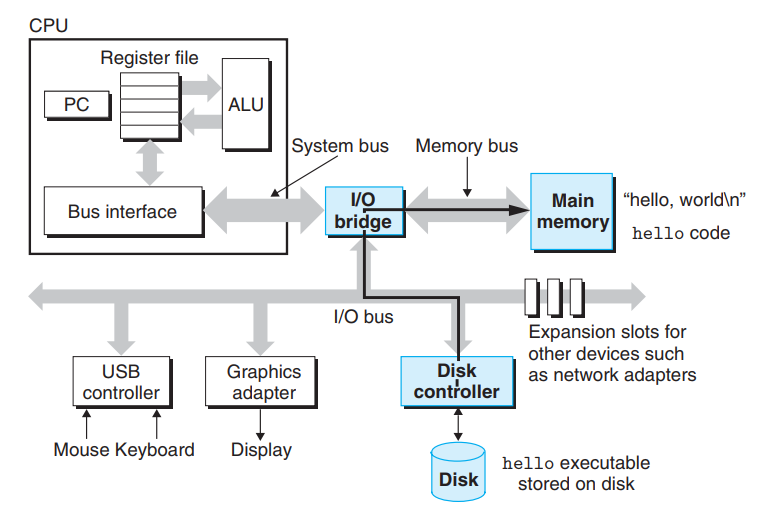
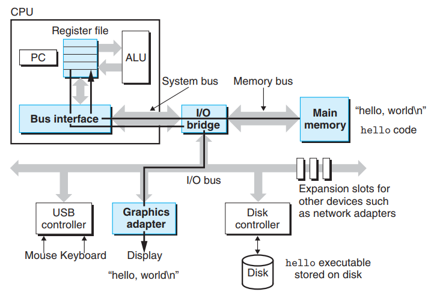

# 信息表示和处理

## 1. 信息存储

### 1.1 寻址和字节循序

对于跨多字节的数据，建立两个规则：

- 对象的地址

  - 多字节对象存储为连续的字节顺序，对象地址为所使用的字节的最小地址

- 内存如何排列这些字节

  - 大端法
  - 小端法

show_bytes 打印出每个以十六进制表示的字节。 C 格式化指令 "%.2x" 表明整
数必须用至少两个数字的十六进制格式输出。size_t表示数据结构大小的首选数
据类型

```C
typedef unsigned char *byte_pointer;

void show_bytes(byte_pointer start, size_t len){
    size_t i;
    for (i = 0; i < len; ++i){
        printf("%.2x", start[i]);
    }
    printf("\n");
}
```

使用例子

字节指针指向int对象的首地址，依次将int对象存储的信息打印出来。

```C
void show_int(int x){
    show_bytes((byte_pointer) &x, sizeof(int));
}
```


### 1.2 表示代码

- 不同的机器指令不兼容且编码方式不同  
- 不同的操作系统编码规则不同


### 1.3 位级运算

- 掩码运算
  - 这里表示位模式，从一个字中选取出位的集合
- 位级运算符
  - | 或
  - & 与
  - ~ 取反
  - ^ 异或

### 1.4 逻辑运算

- 逻辑运算符
  - || OR
  - && AND
  - ! NOT
- 与位级运算符的区别
  - 逻辑算认为所有非零的参数都表示 TRUE, 而参数 0 表示 FALSE
  - && 和 || 有截断性（第一个表示出结果了就不会求第二个表达式）


## 1.5 移位操作

- 逻辑右移：左端补 k 个 0，无符号数必是逻辑右移
- 算术右移：左端补 K 个最高有效位的值

C 语言标准并没有明确定义对千有符号数应该使用哪种类型的右移


## 2. 整数表示

### 2.1 整数数据类型






