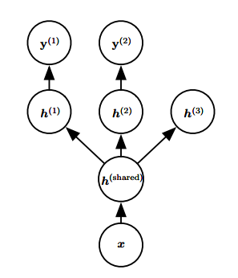
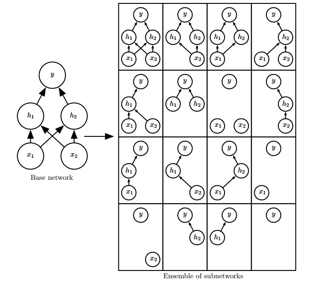

## 正则化

许多策略显式地被设计来减少测试误差（可能会以增大训练误差为代价）。这些策略被统称为正则化

### 1. 惩罚参数

通过对目标函数 J 添加一个参数范数惩罚 Ω(θ)，限制模型（如神经网络、 线性回归或逻辑回归）的学习能力。
$$
\hat{J}(\theta; X; y) = J(\theta; X; y) + αΩ(\theta)
$$

我们通常只对权重做惩罚而不对偏置做正则惩罚 

- 不对其进行正则化也不会导致太大的方差
- 正则化偏置参数可能会导致明显的欠拟合

#### 1.1 L2正则化

通过向目标函数添加一个正则项 
$$
Ω(θ) = \frac{1}{2} ||w||_{2}^2
$$

权重更新变为

$$
w \leftarrow (1 − ϵα)w - ϵ∇_{\omega}J(w; X; y)
$$
加入权重衰减后会引起学习规则的修改，即在每步执行通常的梯度更新之前先收缩权重向量（将权重向量乘以一个常数因子）

只有在显著减小目标函数方向上的参数会保留得相对完好。在无助于目标函数减小的方向（对应 Hessian 矩阵较小的特征值）上改变参数不会显著增加梯度。这种不重要方向对应的分量会在训练过程中因正则化而衰减掉

#### 1.2 L1正则化

$$
Ω(θ) = ||w||_1 = \sum_{i}|w_i|
$$

相比 L2正则化， L1正则化会产生更 稀疏（ sparse）的解。此处稀疏性指的是
最优值中的一些参数为 0。

L1正则化导出的稀疏性质已经被广泛地用于 特征选择（ feature selection）机
制。

### 2. 作为约束的范数惩罚

 Hinton et al. (2012c) 建议结合使用约束和高学习速率，这样能更快地
探索参数空间，并保持一定的稳定性

Hinton et al. (2012c) 尤其推荐由Srebro and Shraibman (2005) 引入的策略：约
束神经网络层的权重矩阵每列的范数，而不是限制整个权重矩阵的 Frobenius 范数。分别限制每一列的范数可以防止某一隐藏单元有非常大的权重。

### 3. 数据集增强

- 创建假数据并添加到训练集中，针对不同情况方法不同，数据增强对分类问题和语音识别非常有效。
- 在神经网络的输入层注入噪声 (Sietsma and Dow, 1991) 也可以被看作是数据增强的一种方式

### 4. 向输出目标注入噪声

**标签平滑**（ label smoothing）通过把确切分类目标从 0 和1 替换成$\frac{\epsilon}{\kappa - 1}$ 和 $1 - \epsilon$， 正则化具有 k 个输出的 softmax 函数 的模型。

标签平滑的优势是能够防止模型追求确切概率而不影响模型学
习正确分类。

### 5. 半监督学习

半监督学习通常指的是学习一个表示 h = f(x)。学习表示的目的是使相同类中的样本有类似的表示

**无监督学习**可以为如何在表示空间聚集样本提供有用线索。在输入空间紧密聚集的样本应该被映射到类似的表示。

### 6. 多任务学习

多任务学习 (Caruana, 1993) 是通过合并几个任务中的样例（可以视为对参数
施加的软约束）来提高泛化的一种方式。

该模型通常可以分为两类相关的参数：

- 具体任务的参数（只能从各自任务的样本中实现良好的泛化）
- 所有任务共享的通用参数（从所有任务的汇集数据中获益）

### 7. 提前终止

L2 正则化和提前终止可以被看作是等价的

### 8. 参数绑定和参数共享

参数范数惩罚是正则化参数使其彼此接近的一种方式，而更流行的方法是使用
约束： 强迫某些参数相等。这种正则化方法通常被称为 参数共享（ parameter sharing）

参数共享的一个显著优点是，只有参数（唯一一个集合）的子集需要被存储在内存中

例如：在图像检测领域，自然图像有许多统计属性是对转换不变的，CNN通过在图像多个位置共享参数来考虑这个特性。参数共享显著降低了CNN模型的参数数量，并显著提高了网络的大小而不需要相应地增加训练数据。

### 9. Bagging 和其他集成方法

Bagging（ bootstrap aggregating）是通过结合几个模型降低泛化误差的技术。主要想法是分别训练几个不同的模型，然后让所有模型表决测试样例的输出，称为 模型平均（ model averaging）

模型平均（ model averaging）奏效的原因是不同的模型通常不会在测试集上产
生完全相同的误差。

Bagging是一种允许重复多次使用同一种模型、训练算法和目标函数的方法

Bagging涉及构造 k 个不同的数据集。每个数据集从原始数据集中重复采样构成，和原始数据集具有相同数量的样例

### 10. Dropout

Dropout提供了一种廉价的Bagging集成近似，能够训练和评估指数级数量的神经网络

最先进的神经网络基于一系列仿射变换和非线性变换，我们只需将一些单元的输出乘零就能有效地删除一个单元

Bagging学习，我们定义 k 个不同的模型，从训练集有放回采样构造k 个不同的数据集，然后在训练集 i 上训练模型 i。 Dropout的目标是在指数级数量的神经网络上近似这个过程。

在Dropout的情况下，所有模型共享参数，其中每个模型继承父神经网络参数
的不同子集。 参数共享使得在有限可用的内存下表示指数级数量的模型变得可能。

在Bagging的情况下，每一个模型在其相应训练集上训练到收敛。在Dropout的情况下，通常大部分模型都没有显式地被训练，因为通常父神经网络会很大取而代之的是，在单个步骤中我们训练一小部分的子网络， 参数共享会使得剩余的子网络也能有好的参数设定。

我们可以通过评估模型中 $p(y | x)$ 来近似 $p_{ensemble}$：该模型具有所有单元，但我们将单元 i 的输出的权重乘以单元 i 的被包含概率。这个修改的动机是得到从该单元输出的正确期望值。我们把这种方法称为 **权重比例推断规则**（ weight scaling inference rule）。实验发现，在对集成预测的近似方面， 权重比例推断规则比蒙特卡罗近似更好（就分类精度而言）。

Dropout优点：

- 计算方便：练过程中使用Dropout产生 n 个随机二进制数与状态相乘，每个样本每次更新只需 O(n) 的计算复杂度。
- 不怎么限制适用的模型或训练过程：乎在所有使用分布式表示且可以用随机梯度下降训练的模型上都表现很好。
- 对于非常大的数据集， 正则化带来的泛化误差减少得很小。在这些情况下，使用Dropout和更大模型的计算代价可能超过正则化带来的好处。
- Dropout强大的大部分原因来自施加到隐藏单元的掩码噪声：这可以看作是对输入内容的信息高度智能化、自适应破坏的一种形式，而不是对输入原始值的破坏。

### 11. 切面距离、正切传播和流形正切分类器

切面距离（ tangent distance）算法是一种非参数的最近邻算法，其中使用的度量不是通用的欧几里德距离，而是根据邻近流形关于聚集概率的知识导出的。

这个算法假设我们尝试分类的样本和同一流形上的样本具有相同的类别。由于分类器应该对局部因素（对应于流形上的移动）的变化保持不变，一种合理的度量是**将点 x1 和 x2 各自所在流形 M1 和 M2 的距离作为点 x1 和 x2 之间的最近邻距离**。然而这可能在计算上是困难的（它需要解决一个寻找 M1 和 M2 最近点对的优化问题），一种局部合理的廉价替代是使用 xi 点处切平面近似 Mi，并测量两条切平面或一个切平面和点之间的距离。这可以通过求解一个低维线性系统（就流形的维数而言）来实现。

正切传播（ tangent prop）算法 (Simard et al., 1992)（图 7.9 ）训练带有额外惩罚的神经网络分类器，使神经网络的每个输出 f(x) 对已知的变化因素是局部不变的。这些变化因素对应于沿着的相同样本聚集的流形的移动。

