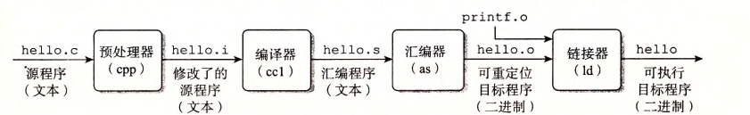
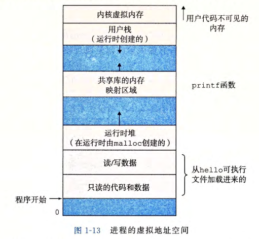
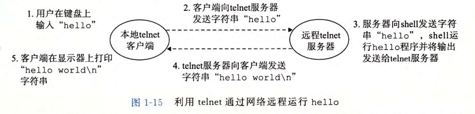

# 计算机漫游

## 1. 程序的执行过程

```C
#include <stdio.h>
int main()
{
printf("hello, world\n");
return O;
}
```



1. 预处理阶段：hello.c 通过预处理，根据字符以#开头的的命令，修改原始C程序，比如#include<stdio.h>命令告诉预处理器选取头文件为stdio.h的内容，并把它插入到程序文本中，得到hello.i。
2. 编译阶段：hello.i 通过汇编器将代码翻译为汇编程序：hello.s
3. 汇编阶段：hello.s 通过汇编器将会变代码翻译为机器代码，hello.o 是一个二进制文件
4. 链接阶段：hello程序调用了printf函数，printf在预编译好的printf.o文件中，链接器负责将处理这种合并，最终得到hello文件，它是一个可执行程序。

## 2. 了解编译器的作用

- 优化代码
- 理解链接中的错误
- 避免安全漏洞
  - 缓冲区溢出错误是造成大多数网络和Internet服务器安全漏洞的主要原因

## 3. 硬件组成

- 总线
  - 贯穿整个操作系统的电子管道
  - 总线被设计成传送定长的字节块（字，word），字长是一个基本的系统参数，随不同系统不同，大多数机器字长要么是4字节（32位），要么是8字节（64位）
- I/O设备
  - 系统与外界的联系通道
  - I/O设备通过控制器和适配器与I/O总线相连，控制器和适配器的主要区别在于封装方式不同
    - 控制器是I/O设备本身或者主板上的芯片组
    - 适配器是一块插在主板上的卡槽
- 主存
  - 临时存储设备，处理器执行时，主存用来存放程序和数据
  - 物理上：由一组DRAM组成
  - 逻辑上：线性的字节数组，每个字节都有唯一的地址，地址从零开始
- 处理器
  - 解释（执行）存储在主存指令的引擎


## 4. 运行程序

1. 通过键入 `./hello`，shell将程序读进寄存器，再把它放在内存中（未命中）
2. 利用直接存储器存取（DMA）技术，数据不通过处理器，直接从磁盘到达主存
3. 一旦代码和数据都加载到主存，处理器就开始执行hello程序中main程序段的机器指令，寄存器将结果复制到显示设备。

## 5. 操作系统管理硬件

### 5.1 操作系统的基本功能

1. 防止硬件被失控的程序滥用
2. 向程序提供简单的方式控制硬件

### 5.2 进程

- 进程是对处理器、主存和I/O设备的抽象表示
- 进程是操作系统对一个正在运行的程序的一种抽象
- 程序像是独立地使用处理器、主存和I/O设备
- 并发运行：多个进程之间的指令交错执行
- 操作系统跟踪进程运行所需的所有状态信息（上下文）

### 5.3 线程

- 一个进程有多个线程执行单元组成
- 每个线程都运行在进程的上下文中，并共享同样的代码和全局数据

### 5.4 虚拟内存

- 虚拟内存是对主存、磁盘和I/O设备的抽象表示
- 虚拟内存使得每个进程都以为自己独占内存
- 每个进程看到的内存都是一致的，成为虚拟内存空间



- 程序代码和数据
  - 按照可执行文件的内容初始化
- 堆
  - 进程一开始就被指定了大小
  - 调用malloc和free等操作可以动态的扩展和伸缩堆
- 共享库
  - 存放C标准库和数据库这样的共享代码和数据
  - 在动态链接中用到
- 栈
  - 编译器使用栈来实现程序的调用
  - 可以动态的伸展和收缩
  - 调用一个程序，栈伸展；函数返回，栈收缩
- 内核虚拟内存
  - 为内核而保留
  - 不允许应用程序读写这个区域或者直接调用内核函数
  - 必须调用内核来调用内核函数

### 5.5 文件

- 文件是对I/O设备的抽象表示
- 文件就是字节序列
- 每个I/O设备都可以看做是文件
- 系统的所有输入输出通过I/O系统函数调用读写文件实现


## 6. 系统间的网络通信

- 从一个单独的系统看，网络可以看做I/O设备
- 远程运行 `hello`




## 7. Amdahl 定律

- 当我们加速系统的某个部分时，其对系统的整体影响取决于该部分的重要性和加速程度
- 要想显著的加速整个系统，必须提升全系统中相当大部分的速度
- 这个定理同样适用于其他领域：降低产品成本，提升成绩等


## 8. 并发和并行

- 并发指一个同时具有多个活动的系统
- 并行：用并发来使得一个程序运行的更快

### 8.1 线程级并发

- 使用线程，能在进程中执行多个控制流
- 多线程允许一个CPU执行多个控制流
- 多处理器从两个方面提升系统性能
  - 减小执行多个任务时模拟并发的需要
  - 以多线程的方式加速程序运行

### 8.2 指令级并行

- 处理器可以同时执行多条指令的属性称为指令级并行
- 原理：流水线
- 超标量处理器：处理器可以达到比一个周期一条指令更快的执行速率

### 8.3 单指令、多数据并行

- 允许一条指令产生多个可以并行执行的操作，这种方式称为单指令、多数据（SIMD）
- SIMD指令主要为了提高处理影像、声音和视频数据应用的执行速度

