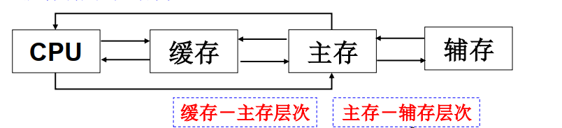

## 1. 存储器概述

### 1.1 存储器分类

#### 1.1.1 存储介质

- 半导体存储器：用MOS管制成
- 磁表面存储器：用磁性材料制成
- 光盘存储器：用光介质制成

#### 1.1.2 存取方式（依赖存储单元的物理位置）

- 随机存储器
- 顺序存储器
- 半顺序存储器：存取时间部分依赖（磁盘）

#### 1.1.3 存储内容是否可变

- 只读存储器（ROM）
- 随机读写存储器（RAM）

#### 1.1.4 在计算机系统的作用

- 辅助存储器（磁盘）
  - 不能被直接CPU访问
  - 保存系统所有的数据和程序
- 主存储器（半导体存储器）
  - 能被直接CPU访问
  - 保存系统当前的数据和程序
- 高速缓冲存储器（Cache）
  - 保存系统运行时频繁访问的数据和程序
- 控制存储器（寄存器）
  - CPU内部存储单元

### 1.2 存储器分级

在CPU看来， 容量相当于辅存容量， 速度相当于CACHE速度。

分级应该解决的问题（由操作系统解决）

- 精确定位辅存中的指定内容调入主存

- CPU访问cache时出现未命中情况

### 1.3 存储器指标

#### 1.3.1 存储容量

- 存储器能否存放的二进制数据的总数

- 存储容量=存储段元个数 × 存储字长（单位：位）

#### 1.3.2 存储速度

- 存取时间
  - 一次操作所用的时间
  - 单位ns，分读出和写入时间
- 存取周期
  - 两次操作之间所需最小的时间间隔
  - 单位ns，存取周期=存取时间+复原时间
- 存储器带宽
  - 每秒存储器进出的最大信息数量
  - 单位：位/秒、字节/秒， 存储带宽=每周期信息量/周期时长

## 2. SRAM（静态RAM）

### 2.0 主存储器的构成

- SRAM
  - MOS电路构成的双稳触发器
  - 速度快，但造价高、功耗大、集成度低
- DRAM
  - MOS电路构成的栅极电容
  - 集成度高、功耗小、价格低，但速度慢

### 2.1 SRAM元阵列

- 基本存储单元
  - 6个MOS管构成一个存储元
  - 存储元为非易失性
- 3种外部信号线
  - 地址线，n根地址线有2^n个单元
  - 数据线，m根数据线对应的单元为m位
  - 控制线：读写控制信号R/W，1位读，0为写

### 2.2 SRAM逻辑结构

#### 2.2.1 译码驱动方式

- 单译码：适用较小的存储器
- 双译码：被选单元由X、Y两个方向的地址决定

#### 2.2.2 组成结构

- 存储体
  - 存储段远集合，按位将存储单元组织成存储矩阵
- 地址译码器
  - 将CPU发出的地址信息转成存储元选通信号
- 译码驱动器
  - X选择线上用于增强驱动能力的电路
- I/O电路
  - 读写电路和放大电路
- 片选
  - CPU选芯片
- 读/写读写控制电路
  - 对存储单元读或写
- 输出驱动电路
  - 增强数据总线的驱动能力

### 2.3 存储容量的扩充

#### 2.3.1 存储芯片和CPU的引脚

- 数据总线
  - 位数与存储单元字长相同，用于传送数据信息
- 地址总线
  - 存储元单元个数=2^n位数，用于选择存储单元
- 读写信号WE
  - 访问类型：读或写
- 片选信号CS
  - 决定当前芯片是否被访问

#### 2.3.2 位拓展

- 存储单元数不变，增加单元位数
- 引脚连接方法
  - 地址线：直接相连
  - 数据线：各芯片的数据线连接CPU不同位的数据线
  - 片选与读写信号：直接相连
- CPU对该存储器的访问是对**各位扩展芯片的同一单元**的同时访问

#### 2.3.3 字拓展

- 单元位数不变，总单元个数增加
- 引脚连接方法：
  - 地址线：芯片的地址线与CPU的低位地址线相连
  - 数据线：直接相连
  - 读写信号：直接相连
  - 片选信号：芯片的片选信号由CPU的高位地址线和访存信号产生
- CPU对该存储器的访问是对**某一字扩展芯片的一个单元**的访问

#### 2.3.4 字位拓展

1. 位拓展，得到满足位需求的存储芯片组
2. 字拓展，使用存储芯片组进行字拓展

### 3. 