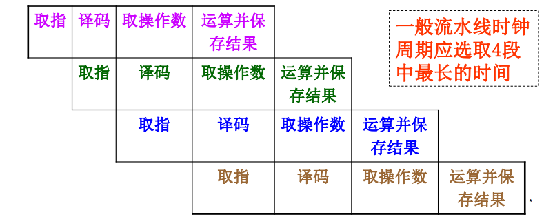

## 1. CPU的组成和功能

### 1.1 基本组成:star:

- 控制器
  - 控制指令存取（PC、IR）
  - 指令译码
  - 控制数据流动（CU、时序电路、操作控制器）
- 运算器
  - 算术运算
  - 逻辑运算

### 1.2 主要功能

- 指令控制
- 操作控制
- 时间控制
- 数据加工

### 1.3 主要寄存器

- 数据缓冲寄存器（DR）
- 通用寄存器
- 状态条件寄存器（PSW）
- 地址寄存器（AR）
- 程序计数器（PC）
- 指令寄存器（IR）

## 2. 指令周期:star:

### 2.1 基本概念

- CPU执行程序是一个不断“取指令-执行指令”的过程
- 指令周期：取指令时间+执行指令时间
- CPU周期（机器周期）
  - 从内存读取一条指令字的最短时间
  - 一个CPU周期可以完成CPU的一个基本操作
- 时钟周期（节拍脉冲或T周期）：操作的基本时间单位

### 2.2 MOV R0 R1的指令周期

`MOV`是RR型指令，需要两个CPU周期

- 取指周期
  1. 从存储器取指令
  2. PC加1
  3. 译码，发出控制信号
- 执行周期
  - 在控制信号作用下，将R1的数据经过ALU送至R0

#### 控制信号

1. 取指周期

## 3. 时序产生器和控制方式

### 3.1 时序信号的作用和体制

- 时序信号作用：使计算机迅速、准确、有条不紊的工作
- CPU通过时序控制来识别指令和数据
  - 第一个CPU周期（取指周期）
  - 其他CPU周期（执行周期）
- 时序信号体制：电位-脉冲机制

### 3.2 控制方式

- 同步控制方式
- 异步控制方式
- 联合控制方式

## 4. 微程序控制器:star:

### 4.1 微程序控制原理

**微程序设计技术**

- 利用软件方法来设计硬件
- 把操作控制信号编成“微指令”，存放到ROM中

#### 4.1.1 微命令和微操作

- 控制部件与执行部件
  - 控制部件向执行部件发出控制信号
  - 执行部件向控制部件反馈状态信息
- 微命令
  - 控制部件向执行部件发出各种控制操作
- 微操作
  - 执行部件接受微命令所执行的各种操作
- 状态测试
  - 控制部件根据执行部件的反馈信号，决定下一步的伪指令

根据能否在同一个CPU周期内并行执行的微操作分为

- 相容性微操作
- 相斥性微操作

#### 4.1.2 微指令和微程序

- 微指令
  - 一个CPU周期内，实现一定操作功能的微命令的集合
  - 包含操作控制和顺序控制
    - 操作控制：发出管理和指挥机器工作的信号
    - 顺序控制：决定下一条微指令的地址
  - 微指令存放在控制存储器中，使用地址访问
- 微程序
  - 实现一条机器指令的微指令集合

#### 4.1.3 微程序控制器原理框图

- 控制存储器（CM）
  - 存放所有微指令
  - 由ROM构成，速度快
- 微指令寄存器：存放由CM读出的微指令信息
  - 微地址寄存器：下一条微指令地址
  - 微命令寄存器：下一条微指令的操作控制字段和判别测试字段的信息
- 地址转移逻辑
  - 跳跃寻址时，修改微地址

#### 4.1.4 CPU周期和微指令周期的关系

- 微指令周期：读出时间+执行时间
- 一般地，微指令周期时间=CPU周期时间

#### 4.1.5 机器指令与微指令的关系

- 一条机器指令由多条微指令组成

### 4.2 微指令设计

#### 4.2.1 微指令编码

- 操作控制字段的编码表示方法
- 直接表示法
  - 操作控制字段的每一位代表一个微命令
- 编码表示法
  - 将操作控制字段划分为若干子字段
  - 每个子字段的所有微命令进行统一编码
- 混合表示法

#### 4.2.2 微地址的形成方法

一些概念

- 微程序入口地址：第一条微指令在控制存储器中的地址
- 现行微指令：正在执行的微指令
- 后继微指令：下一条要执行的微指令

确定下一条微指令地址的方式

- 计数器方式
- 多路转移方式：根据“判别测试”标志和“状态条件”信息选定某一个候选微地址

#### 4.2.3 微指令格式

- 水平型微指令
  - 能并行执行多条微命令的微指令
  - 操作控制字段+判别测试字段+下地址字段
  - 根据控制字段编码方式分类
    - 全水平型
    - 字段译码法水平型
    - 直接和译码相混合的水平型
- 垂直型微指令
  - 微指令中设置微操作码字段，采用微操作码编译，由操作码规定微指令功能
  - 类似于机器指令结构

#### 4.2.4 动态微程序设计

- 静态微程序设计
  - 一组微程序设计好之后难以改变
- 动态微程序设计
  - 通过改变微指令和微程序来改变机器的指令系统的微程序设计技术

## 5. 硬连线控制器

- 由门电路和触发器构成的复杂树状网络
- 早期设计计算机的一种方法
- 与微程序控制相比， 硬布线控制的速度较快

## 6. 流水CPU:rocket:

### 6.1 并行处理技术

- 并行性的两种含义
  - 同时性：多个事件发生在同一时刻
  - 并发性：多个事件发生在同一间隔
- 并行性的三种形式
  - 时间并行：使用流水部件，使得时间重叠
  - 空间并行：设置重复资源，同时工作
  - 时间+空间并行：时间资源+空间资源的综合利用

### 6.2 流水CPU的结构

#### 6.2.1 流水计算机的系统组成

- 流水CPU构成
  - 指令部件
  - 指令队列
  - 执行部件
- 主存采用多体交叉存储器，提高访问速度

#### 6.2.2 流水CPU时空图

将一条指令分成n段，并行执行

计算流水CPU的加速比

- 非流水线CPU处理n个任务时，所需时钟周期数

$$
T_1= n \times k
$$

- k个阶段的流水CPU处理n个任务，需要的时钟周期数
  - k个时钟周期用于处理第一个任务
  - k个周期后，流水线被装满，剩余的n－1个任务只需n-1个周期即可完成

$$
T_k = k + (n-1)
$$

- 将T1和Tk的比率定义为k级线性流水处理器的加速比：

$$
C_k = \frac{T_1}{T_k}
$$

#### 6.2.3 流水线分类

- 指令流水线
  - 指令并行执行
  - 分为取指、译码、取操作数、执行、写回等过程
- 算术流水线
  - 运算并行处理
- 处理机流水线
  - 程序并行处理
  - 每一阶段的处理分散在不同的机器上，应用于多级系统中

### 6.3 流水线主要问题

- 资源相关
  - 争用同一功能部件
  - 解决方法
    - 推迟周期
    - 将数据与指令存储器分离；或采用双端口存储器
- 数据相关
  - 后一条指令依赖前一条指令
  - 解决方法
    - 推迟周期
    - 数据定向（旁路）技术，直接采用运算器的结果
    - 改变程序的执行顺序，将无关指令提前执行
- 控制相关
  - 根据转移条件是否发生来控制指令的执行顺序
  - 分类
    - 写后读(RAW)相关
    - 读后写(WAR)相关
    - 写后写(WAW)相关

