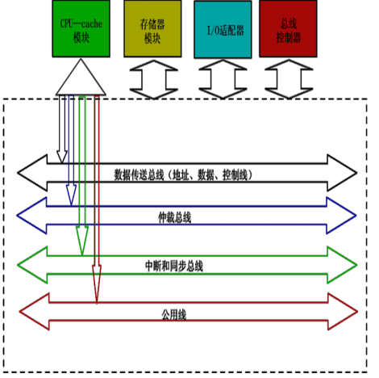

## 1. 总线的概念和结构形态:star:

### 1.1 基本概念

- 总线
  - 系统间各功能部件信息传输的桥梁
- 按传送信息分类
  - 数据总线
    - 单向，三态总线，传送数据信息
    - 位数决定可直接寻址范围
  - 地址总线
    - 双向，三态总线，传送地址信息
    - 位数有8、16、32、64位
  - 控制总线
    - 传送控制、状态信息
    - 决定计算机特色，位数不变
- 按连接部件分类
  - 内部总线：芯片内部逻辑器件的连接总线
  - 局部总线：CPU与其他部件的连接总线
  - 系统总线：计算机各功能部件的连接总线
  - 通信总线（IO总线）：微机系统与微机系统、其他设备之间的连接总线

### 1.2 总线连接方式

- 适配器（接口）
  - 解决CPU与外设之间的速度匹配和同步问题
- 三种基本形态
  - 单总线结构：单一的总线连接CPU、内存与IO设备
  - 双总线结构：CPU与主存之间专门设置一组高速的存储总线
  - 三总线结构：外部设备与通道之间增加一组IO总线
  - 多总线结构：通过桥将多总线连接
- InfiniBand标准
  - 总服务器与IO以及服务器之间的通信工业标准
  - 可交换的 、点对点的通信网络 

### 1.3 总线内部结构

- 早期总线
  - CPU芯片引脚的延伸
- 现代总线
  - 多采用标准总线
  - 四个部分
    - 数据传送总线
    - 仲裁总线
    - 中断和同步总线
    - 公用线

- 南桥北桥
- PC/XT总线
- ISA总线
- EISA总线

## 2. 总线接口

### 2.1 信息传送方式

- 串行传送：一条传输线、脉冲传送
- 并行传送：每个数据位需要一条传输线、点位传送
- 分时传送：
  - 总线传送信息的分时复用
  - 共享总线部件对总线的分时复用

### 2.2 接口概念

- 接口
  - IO设备适配器
  - CPU与主存、外围设备通过总线进行连接的逻辑部件
- 接口典型功能
  - 控制、缓冲、状态、转换、中断
- 一个适配器必有两个接口
  - 与系统总线相连，并行
  - 同设备相连，并行或串行

## 3. 总线的仲裁:star:

### 3.0 基本概念

- 连接到总线的功能模块有主动与被动两种状态
  - 主方可以启动一个周期
  - 从方只能响应主方请求
  - 总线操作中，只能有一个主方，可以有多个从方
- 总线仲裁部件
  - 多个功能块争用总线时，总线仲裁部件选择一个主设备使用总线
- 总线占用期
  - 主方持续控制总线的时间
- 总线仲裁方式
  - 集中式：中央仲裁器决定总线使用权的归属
  - 分布式：多个仲裁器竞争使用总线

### 3.1 集中式仲裁

- 链式查询方式：设备的优先权由总线控制器距离决定
- 计数器定时查询：设备的优先权由计数值决定
- 独立请求方式：设备的优先权由中央仲裁器的内部排队逻辑决定

### 3.2 分布式仲裁

- 不需要中央仲裁器，由分布在各部件中的多个仲裁器竞争使用总线
- 每个潜在的主模块都有自己的仲裁器和唯一的仲裁号，通过比较总线上的仲裁号，决定可占用总线的部件
- 以优先级仲裁策略为基础

## 4. 总线的定时和数据传送模式

### 4.1 总线的定时

- 总线的信息传送过程
- 定时：确定事件出现在总线上的时序关系
- 分类
  - 同步定时：采用统一的时钟信号，所有事件的出现由该时钟确定
  - 异步定时：系统依靠应答方式或互锁机制决定事件出现时间

### 4.2 据传送模式

- 读写操作
  - 主设备利用主线完成与从设备直接的数据传输
- 块传送操作（猝发式传送）
  - 给出块起始地址，对固定长度的数据连续的读写
- 写后读、读修改写操作
- 广播、广集操作