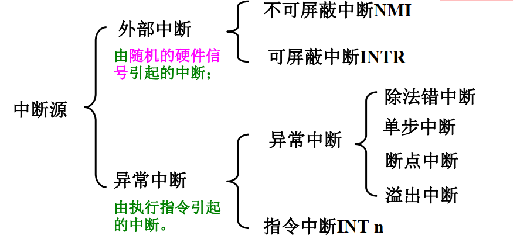
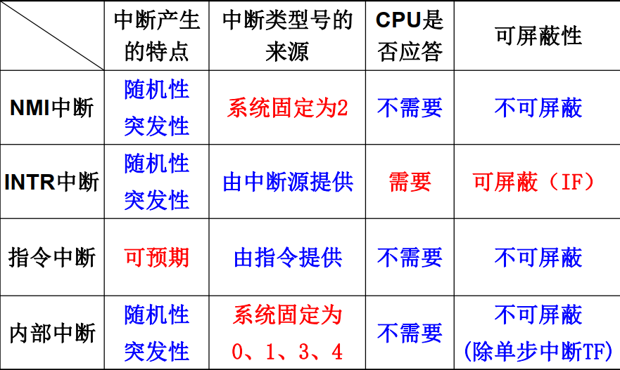

## 1. 外围设备的速度分级与信息交换方式

### 1.1 外围设备的速度分级

分级原因：使得CPU与外设同步工作

根据外设工作速度分为

- 速度极慢或简单的外围设备（接卸开关、发光二极管）
  - CPU直接接发数据
- 慢速或中速的外围设备（键盘）
  - 采用异步定时方式
  - CPU与外设通过两个联络信号（询问、应答）决定数据传送时间
- 高速的外围设备（主存）
  - 同步定时方式
  - CPU以等间隔（时钟脉冲决定）速率执行输入输出指令

### 1.2 外设信息交互方式

| 方式     | 程序查询                                      | 程序中断                                                     | 直接内存访问（DMA）                                       | 通道交换                 |
| -------- | --------------------------------------------- | ------------------------------------------------------------ | --------------------------------------------------------- | ------------------------ |
| 工作过程 | CPU传送数据之前检查外设状态，直到外设准备就绪 | 启动外设后CPU仍可处理其他事件；外设就绪后，通过中断方式和CPU完成数据传送 | CPU分配总线使用权 硬件DMA控制器；（DMAC）控制完成数据传送 | 通道统一管理输入输出设备 |
| 硬件要求 | 接口电路的状态、数据口                        | 附加的中断控制电路                                           | DMAC、数据通路                                            | IO通道（IO处理器， IOP） |
| 适用     | CPU不忙，速度要求不高的外设                   | 适用CPU与慢速外设                                            | 有高速外设的系统                                          | 高性能系统               |

## 2. 程序查询方式

- 数据的输入输出完全由程序控制
- 设备编址
  - 统一编址：IO系统与主存系统作为一个主体
  - 独立编址：IO系统与主存系统独立
- 输入输出指令
  - 输入指令：`IN`：从端口读取字节/字到累加器
  - 输出指令：`OUT`：从累加器读取字节/字到指定端口
- 接口
  - CPU通过地址信号选择接口
  - CPU向接口发送命令字，启动外设
  - 外设开始工作，处于“忙”状态
  - CPU与外设通过接口内部的数据缓冲器传送数据
- 输入输出方式
  - 可通过改变查询顺序修改设备优先级

## 3. 程序中断方式:fire:

### 3.1 概念

-  中断定义
  - 时间：CPU正常运行程序时
  - 中断源（所有引起中断的事件）：系统内外部非预期事件或程序预先安排好的指令事件
  - 执行中断：CPU暂停当前程序，转而去执行事件的服务程序
  - 执行返回：服务完毕返回原程序继续执行

- 中断过程由软件与硬件结合完成
- Why 中断？
  - 使得CPU与IO并行工作，提高速度
  - 对意外情况能够及时处理（磁盘损坏、溢出等）
  - 实时控制性能好
- 中断流程
  - 中断请求
    - CPU结束一个周期后，检测中断请求
  - 中断响应
    - 关中断（硬件）
    - 保护断点现场（硬件+软件）
    - 判断中断源、获取中断向量
    - 根据中断向量转入中断服务程序
  - 中断服务
    - 保护CPU现场（保护寄存器内容）
    - 执行中断服务
    - 开中断（软件）
    - 恢复CPU现场
  - 中断返回
    - 恢复断点现场，返回主程序继续执行

- 中断向量
  - 中断服务程序的入口地址
  - 段地址和段内偏移地址，共4字节
  - CPU响应中断，将对应的中断向量送入CS、 IP寄
    存器中
- 中断向量表
  - 集中存放系统中所有中断向量的存储区
- 中断类型号
  - 中断类型号（n） × 4 ＝ 中断向量在表中的偏移地址

### 3.2 程序中断方式的基本I/O接口

- 接口内部组成
  - 数据缓冲寄存器
  - 触发器
    - 就绪触发器RD
    - 忙状态触发器BS
    - 允许中断触发器EI
  - 中断向量产生逻辑
- CPU相应部件
  - 中断请求触发器IR
  - 中断屏蔽触发器IM

### 3.3 中断处理策略

#### 3.3.1 单级中断系统

- 所有中断属于同一个级别，不允许中断嵌套
- 单级中断源识别：串行排队链法
- 中断向量产生
  - 向量中断：硬件产生一个与该中断源对应的向量地址
  - 位移量中断：硬件产生位移量，位移量+基地址得到中断程序入口地址
  - 向量地址转移：硬件产生一个中断源对应的固定地址码

#### 3.3.2 多级中断系统

- 多级中断中需要进行优先权的控制和判断
- 一维多级中断
  - 每级仅有一个中断源
  - 中断屏蔽触发器IM：决定对应级别的中断源是否能够被响应
  - 中断优先权控制
- 二维多级中断结构
  - 每级包含多个中断源
  - 同级的中断源的服务是不能嵌套的

### 3.4 PC系列机中断机制

- 不可屏蔽中断NMI
  - CPU的NMI引脚引入该中断请求,CPU得到请求**立即响应**
  - 中断类型号：2
  - 优先权高于可屏蔽中断INTR，用于紧急情况，用户不可用
  - 常见的NMI中断
    - 系统RAM奇偶校验错、 I/O通道校验错、协处理器出错
- 可屏蔽中断INTR
  - CPU的INTR引脚引入该中断，中断允许标志位IF=1，CPU才响应
  - 中断类型号：中断源提供
  - 常见的INTR中断
    - 外部设备的中断请求，如I/O设备的数据传送请求，用户可自行设计
- 指令中断`INT n`
  - 预先安排好的中断指令引起的
  - 可预期的、且不可屏蔽的
  - 中断类型号的范围为5≤n≤255
  - 包括
    - BIOS中断、 DOS中断、用户自定义中断
- 异常中断
  - CPU内部的突发事件引起的中断，不可屏蔽
  - 中断类型号
    - 除法中断0
    - 单步中断1
    - 断点中断3
    - 溢出中断4

## 4. DMA方式

### 4.1 概念

- DMA：磁盘与主存之间的数据传送
  - 完全由硬件控制
  - DMAC完全接管系统总线控制权，数据不经过CPU
- DMAC的工作
  - 接受外设DMA请求，交给CPU
  - 接管总线的控制权，控制数据传输
  - 交还总线使用权

### 4.2 DMA传送方式

- DMAC与CPU分时复用总线
- 常见传送方式
  - 停止CPU访问
  - 周期挪用方式
    - 通过外设挪用一个或几个主存周期
  - DMA与CPU交替访问方式
    - 通过外设挪用一个或几个主存周期

### 4.3 DMA数据传送过程

- DMA请求
  - 向CPU请求总线使用权
- DMA响应
  - 给DMAC分配总线使用权
- DMA传送
  - DMAC寻址
  - DMAC控制数据传输
- DMA结束
  - DMAC归还总线使用权

### 4.4 DMA与中断区别

| 方式             | 中断             | DMA              |
| ---------------- | ---------------- | ---------------- |
| 数据传送方式实现 | 程序传送         | 硬件实现         |
| CPU响应请求时间  | 一个指令周期结束 | 一个总线周期结束 |
| 请求目的         | CPU服务          | 总线使用权       |
| 是否保护现场     | 需要             | 不需要           |
| 优先权           | 低               | 高               |

## 5. 通道

### 5.1 通道功能

- 执行通道指令
- 组织外围设备与内存进行数据传输
- 启动外围设备
- 向CPU报告中断

### 5.1 通道类型

- 选择通道
  - 物理上可连接多个设备，但不能同时工作
- 多路通道
  - 同时处理多个设备的IO

## 6. 通用I/O标准接口

- 并行I/O标准接口SCSI
  - IBM
  - 使CPU摆脱对各种设备繁杂的控制
  - 高速智能接口，可混接各种设备
- 高速串行I/O标准接口IEEE 1394
  - 苹果
  - 速度快、实时
  - 应用于家电等消费类设备

