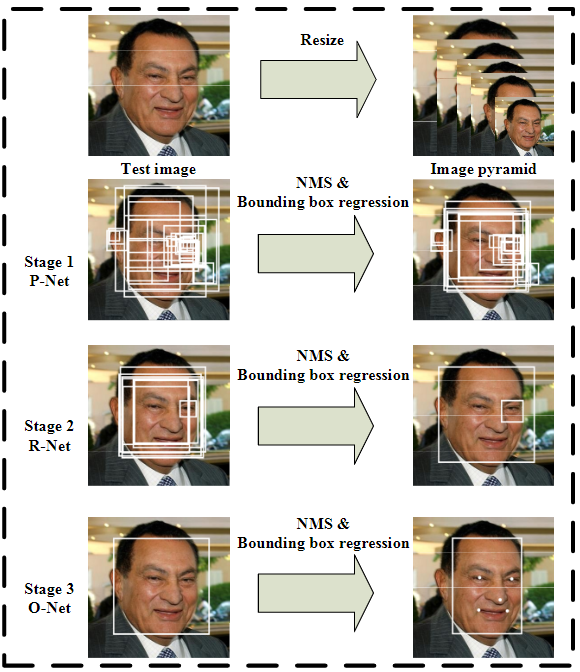
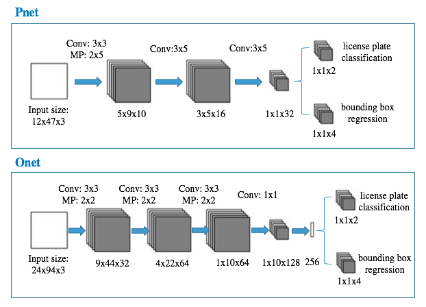

# MTCNN

[论文地址](https://arxiv.org/abs/1604.02878)

概括：**图像金字塔+3阶段级联CNN**



网络结构



- [网络结构解释](https://www.cnblogs.com/shine-lee/p/10115582.html#%E5%86%99%E5%9C%A8%E5%89%8D%E9%9D%A2)

- 应用：
  - [检测车牌](https://github.com/xuexingyu24/License_Plate_Detection_Pytorch/)

## 数据处理

### 命令参数

```python
import argparse

parser = argparse.ArgumentParser(description)
parser.add_argument("--image", help="image path", default=path, type=str)
args = parser.parse_args()


```


### 文件操作

```python
# 目录下所有文件
from imutils import paths
img_paths = [el for el in paths.list_images(img_dir)]
file_paths = [el for el in paths.list_files(img_dir)]

# os.path 基本用法
os.path.basename # 获取文件名
os.path.join(dir, filename)
os.mkdir(dir) # 如果目录有多级，则创建最后一级，如果最后一级目录的上级目录有不存在的，则会抛出一个 OSError
os.makedirs(dir, exist_ok=True) # 递归的创建文件
os.path.exists(dir)

```


### 数据处理

```python
# 定义map data
from torch.utils.data import Dataset
class dataset(Dataset):
    def __init__(self, data_path):
        pass
    def __len__(self):
        return len(data)
   	def __getitem__(self, index):
        return single_data
    
```


### pytorch

```python
# 控制是否使用梯度, phase in ['train', 'eval']
torch.set_grad_enabled(phase == 'train')

```


# 总结

在检测车牌中， 由于车牌比较水平，所以检测效果较好；在检测水表数据的时候，数据旋转的厉害（大意了），效果极差，不多烦叙。