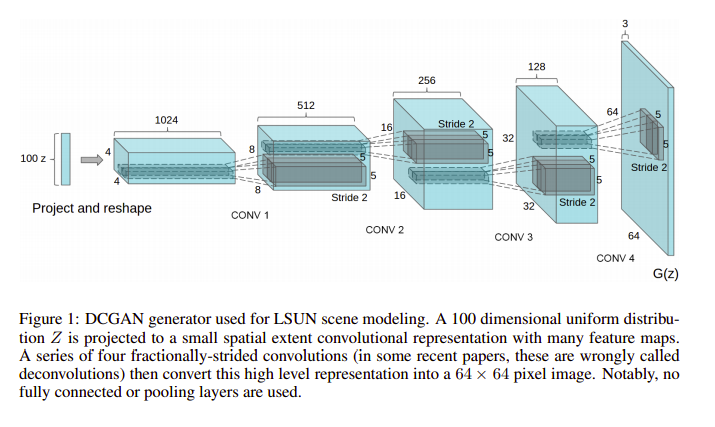

# GAN

## Model




```python
class Discriminator(nn.Module):
    def __init__(self, channels_img, features_d):
        super(Discriminator, self).__init__()
        self.net = nn.Sequential(
            # N x channels_img x 64 x 64
            nn.Conv2d(channels_img, features_d, kernel_size=4, stride=2, padding=1),
            nn.LeakyReLU(0.2),
            # N x features_d x 32 x 32
            nn.Conv2d(features_d, features_d * 2, kernel_size=4, stride=2, padding=1),
            nn.BatchNorm2d(features_d * 2),
            nn.LeakyReLU(0.2),
            nn.Conv2d(
                features_d * 2, features_d * 4, kernel_size=4, stride=2, padding=1
            ),
            nn.BatchNorm2d(features_d * 4),
            nn.LeakyReLU(0.2),
            nn.Conv2d(
                features_d * 4, features_d * 8, kernel_size=4, stride=2, padding=1
            ),
            nn.BatchNorm2d(features_d * 8),
            nn.LeakyReLU(0.2),
            # N x features_d*8 x 4 x 4
            nn.Conv2d(features_d * 8, 1, kernel_size=4, stride=2, padding=0),
            # N x 1 x 1 x 1
            nn.Sigmoid(),
        )

    def forward(self, x):
        return self.net(x)


class Generator(nn.Module):
    def __init__(self, channels_noise, channels_img, features_g):
        super(Generator, self).__init__()

        self.net = nn.Sequential(
            # N x channels_noise x 1 x 1
            nn.ConvTranspose2d(
                channels_noise, features_g * 16, kernel_size=4, stride=1, padding=0
            ),
            nn.BatchNorm2d(features_g * 16),
            nn.ReLU(),
            # N x features_g*16 x 4 x 4
            nn.ConvTranspose2d(
                features_g * 16, features_g * 8, kernel_size=4, stride=2, padding=1
            ),
            nn.BatchNorm2d(features_g * 8),
            nn.ReLU(),
            nn.ConvTranspose2d(
                features_g * 8, features_g * 4, kernel_size=4, stride=2, padding=1
            ),
            nn.BatchNorm2d(features_g * 4),
            nn.ReLU(),
            nn.ConvTranspose2d(
                features_g * 4, features_g * 2, kernel_size=4, stride=2, padding=1
            ),
            nn.BatchNorm2d(features_g * 2),
            nn.ReLU(),
            nn.ConvTranspose2d(
                features_g * 2, channels_img, kernel_size=4, stride=2, padding=1
            ),
            # N x channels_img x 64 x 64
            nn.Tanh(),
        )

    def forward(self, x):
        return self.net(x)
```


## Training

```python
import torch
import torch.nn as nn 
import torch.optim as optim
import torchvision.transforms as T
import torchvision.datasets as datasets

from models import Discriminator, Generator
device = torch.device('cuda' if torch.cuda.is_available() else 'cpu')


# Hyper Parameters
lr = 5e-4
batch_size = 64
image_size = 64 # 1x28x28
channels_img = 1
channels_noise = 256
num_epochs = 200

features_d =16
features_g = 16

transforms = T.Compose([
    T.Resize(image_size), 
    T.ToTensor(),
    T.Normalize((0.5,), (0.5, ))
])


# model
Dnet = Discriminator(channels_img, features_d)
Gnet = Generator(channels_noise, channels_img, features_g)

Doptimizer = optim.Adam(Dnet.parameters(), lr=lr, betas=(0.5, 0.999))
Goptimizer = optim.Adam(Gnet.parameters(), lr=lr, betas=(0.5, 0.999))

Dnet.train()
Gnet.train()

criterion = nn.BCELoss()

real_label = 1
fake_label = 0

fixed_noise = torch.randn(image_size, channels_noise, 1, 1).to(device)

# load data
dataset = datasets.FashionMNIST(
    root='/home/hichens/Practice/torch/Datasets/FashionMNIST', train=True, transform=transforms, download=True
)
dataloader = torch.utils.data.DataLoader(dataset, batch_size=batch_size, shuffle=True)

print("training on {}...".format(device))
for epoch in range(num_epochs):
    for data, targets in dataloader:
        data = data.to(device)
        batch_size = data.shape[0]
        
        ### Train Discriminator: max log(D(x)) + log(1 - D(G(z)))
        Dnet.zero_grad()
        label = (torch.ones(batch_size)*0.9).to(device)
        output = Dnet(data).reshape(-1) # 64 
        Dloss_real = criterion(output, label)
        D_x = output.mean().item()

        noise = torch.randn(batch_size, channels_noise, 1, 1)
        fake = Gnet(noise) # 64x1x64x64
        label = (torch.ones(batch_size)*0.1).to(device)
        output = Dnet(fake.detach()).reshape(-1) # 64
        Dloss_fake = criterion(output, label)

        Dloss = Dloss_real + Dloss_fake
        Dloss.backward()
        Doptimizer.step()

        ### Train Generator: max log(D(G(z)))
        Gnet.zero_grad()
        label = torch.ones(batch_size).to(device)
        output = Dnet(fake).reshape(-1)
        Gloss = criterion(output, label)
        Gloss.backward()
        Goptimizer.step()


    if (epoch+1) % 10 == 0:
        print(
            f"Epoch [{epoch}/{num_epochs}] Batch {epoch+1}/{len(dataloader)} \
                Loss D: {lossD:.4f}, loss G: {lossG:.4f} D(x): {D_x:.4f}"
        )

```

