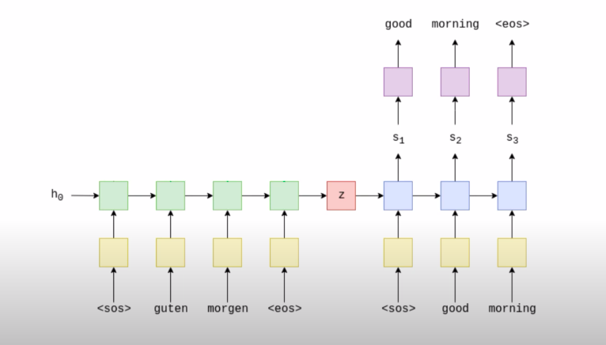

# Seq2Seq



## 1. Encoder

```python
class Encoder(nn.Module):
    def __init__(self, input_size, embedding_size, hidden_size, num_layers, dropout):
        super(Encoder, self).__init__()
        self.embedding = nn.Embedding(input_size, embedding_size)
        self.dropout = nn.Dropout(dropout)
        self.lstm = nn.LSTM(embedding_size, hidden_size, num_layers, dropout=dropout)
    
    def forward(self, X):
        # X: input_size X embedding_size
        embedding = self.dropout(self.embedding(X))
        output, (hidden, cell) = self.lstm(embedding)
        return hidden, cell
```


## 2. Decoder

```python
class Decoder(nn.Module):
    def __init__(self, input_size, embedding_size, hidden_size, output_size, num_layers, dropout):
        super(Decoder, self).__init__()
        self.embedding = nn.Embedding(input_size, embedding_size)
        self.dropout = nn.Dropout(dropout)
        self.lstm = nn.LSTM(embedding_size, hidden_size, num_layers, dropout=dropout)
        self.fc = nn.Linear(hidden_size, output_size)

    def forward(self, x, hidden, cell):
        # x: word
        x = x.unsqueeze(0)
        embedding = self.dropout(self.embedding(x))
        output, (hidden, cell) = self.lstm(embedding, (hidden, cell))
        pred = self.fc(output)
        return pred.squeeze(0), hidden, cell
```


## 3. Seq2Seq

```python
class Seq2Seq(nn.Module):
    def __init__(self, encoder, decoder):
        super(Seq2Seq, self).__init__()
        self.encoder = encoder
        self.decoder = decoder

    def forward(self, source, target, target_vocab_size, tearch_force_ratio=0.5):
        target_len, batch_size = target.shape
        outputs = torch.zeros(target_len, batch_size, target_vocab_size).to(device)
        hidden, cell = self.encoder(source)

        x = target[0]
        for t in range(1, target_len):
            output, hidden, cell = self.decoder(x, hidden, cell)
            outputs[t] = output
            best_guess = output.argmax(1)
            x = target[t] if random.random() < tearch_force_ratio else best_guess
        return outputs
```


## 4. load_data

```python
def load_data(batch_size=64, max_size=10000, min_freq=2):
    spacy_ger = spacy.load('de_core_news_sm')
    spacy_eng = spacy.load('en_core_web_sm')
    tokenize_ger = lambda text: [tok.text for tok in spacy_ger.tokenizer(text)]
    tokenize_eng = lambda text: [tok.text for tok in spacy_eng.tokenizer(text)]
    german = Field(tokenize=tokenize_ger, lower=True, init_token='<sos>', eos_token='<eos>')
    english = Field(tokenize=tokenize_eng, lower=True, init_token='<sos>', eos_token='<eos>')
    train_data, valid_data, test_data = Multi30k.splits(exts=('.de', '.en'), fields=(german, english))
    german.build_vocab(train_data, max_size=max_size, min_freq=min_freq)
    english.build_vocab(train_data, max_size=max_size, min_freq=min_freq)
    train_iter, valid_iter, test_iter = BucketIterator.splits(
        (train_data, valid_data, test_data),
        batch_size=batch_size,
        sort_within_batch=True,
        sort_key=lambda x: len(x.src),
        device=device
    )
    return train_iter, test_iter, test_iter, german, english
```


## 5. Training 

```python
## Hyper Parameters
max_size = 10000
batch_size = 64
num_epochs = 1
embedding_size = 300
hidden_size = 1024
num_layers = 2
dropout = 0.5
lr = 1e-3
load_model = True


## load data
train_iter, test_iter, test_iter, german, english = load_data()
input_size_encoder = len(german.vocab)
input_size_decoder = len(english.vocab)
output_size = len(english.vocab)

# net 
encoder = Encoder(input_size_encoder, embedding_size, hidden_size, num_layers, dropout)
decoder = Decoder(input_size_decoder, embedding_size, hidden_size, output_size, num_layers, dropout)
net = Seq2Seq(encoder, decoder)
optimizer = optim.Adam(net.parameters(), lr)
pad_idx = english.vocab.stoi['<pad>']
criterion = nn.CrossEntropyLoss(ignore_index=pad_idx)

if load_model and os.path.exists('./save/my_checkpoints.pth.tar'):
    checkpoint = torch.load('./save/my_checkpoints.pth.tar')
    load_checkpoint(checkpoint, model, optimizer)

target_vocab_size  = len(english.vocab)

"""training"""
writer = SummaryWriter(f"runs/loss_plot")
step = 0
print("training on {}".format(device))
net.train()
for epoch in range(num_epochs):
    for batch_idx, batch in enumerate(train_iter):
        source = batch.src.to(device)
        target = batch.trg.to(device)
        output = net(source, target, target_vocab_size)
        output = output[1:].reshape(-1, output.shape[2])
        target = target[1:].reshape(-1)

        optimizer.zero_grad()
        loss = criterion(output, target)
        loss.backward()
        nn.utils.clip_grad_norm_(net.parameters(), max_norm=1)
        optimizer.step()

        writer.add_scalar("Training loss", loss, global_step=step)
        step += 1
    if (epoch+1) %10 == 0:
        print("epoch: {}, training loss: {}".format(epoch+1, loss))

## save model
checkpoint = {"state_dict": net.state_dict(), "optimizer": optimizer.state_dict()}
save_checkpoint(checkpoint)

## eval
net.eval()
sentence = "ein boot mit mehreren männern darauf wird von einem großen pferdegespann ans ufer gezogen."
translated_sentence = translate_sentence(
    net, sentence, german, english, max_length=50
)
print(sentence)
print("==>")
print(f"Translated example sentence: \n {translated_sentence}")
```


# Attention

```python
class Encoder(nn.Module):
    def __init__(self, input_size, embedding_size, hidden_size, num_layers, p):
        super(Encoder, self).__init__()
        self.embedding = nn.Embedding(input_size, embedding_size)
        self.lstm = nn.LSTM(embedding_size, hidden_size, num_layers, bidirectional=True)

        self.fc_hidden = nn.Linear(hidden_size * 2, hidden_size)
        self.fc_cell = nn.Linear(hidden_size * 2, hidden_size)
        self.dropout = nn.Dropout(p)
        
     def forward(self, X):
        embedding = self.dropout(self.embedding(X))
        encoder_state, (hidden, cell) = self.lstm(embedding)
        # encoder_state shape: (seq_length, N, hidden_size)
        hidden = self.fc_hidden(torch.cat(hidden[0:1], hidden[1:2], dim=2)) # foward and backward direction
        cell = self.fc_cell(torch.cat((cell[0:1], cell[1:2]), dim=2))
        return encoder_state, hidden, cell
    

class Decoder(nn.Module):
    def __init__(self, input_size, embedding_size, hidden_size, output_size, num_layers, p):
        super(Decoder, self).__init__()
        self.embedding = nn.Embedding(input_size, embedding_size)
        self.lstm = nn.LSTM(hidden_size * 2 + embedding_size, hidden_size, num_layers)
        
		self.energy = nn.Linear(hidden_size*3, 1)
        self.fc = nn.Linear(hidden_size, output_size)
        self.dropout = nn.Dropout(p)
        self.softmax = nn.Softmax(dim=0)
        self.relu = nn.Relu()
        
    def forward(self, x, encoder_state, hidden, cell):
        x = x.unsqueeze(0)
        embedding = self.dropout(self.embedding(x))
        sequence_length = encoder_states.shape[0]
        h_reshaped = hidden.repeat(sequence_length, 1, 1)
        # h_reshaped: (seq_length, N, hidden_size*2)
        energy = self.relu(self.energy(torch.cat((h_reshaped, encoder_states), dim=2)))
        # energy: (seq_length, N, 1)
        attention = self.softmax(energy)
        # attention: (seq_length, N, 1), snk
        # encoder_states: (seq_length, N, hidden_size*2), snl
        # we want context_vector: (1, N, hidden_size*2), i.e knl
        context_vector = torch.einsum("snk,snl->knl", attention, encoder_states)
        rnn_input = torch.cat((context_vector, embedding), dim=2)
        # rnn_input: (1, N, hidden_size*2 + embedding_size)
        outputs, (hidden, cell) = self.lstm(rnn_input, (hidden, cell))
        # outputs shape: (1, N, hidden_size)
        predictions = self.fc(outputs).squeeze(0)
        # predictions: (N, hidden_size)

        return predictions, hidden, cell
```

