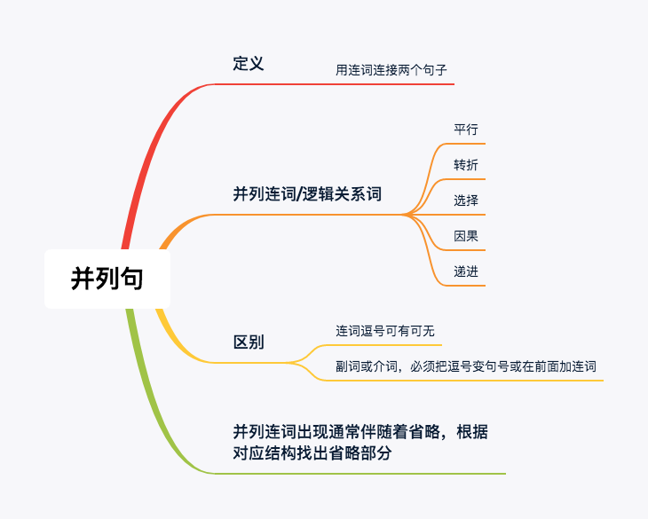

## 1. 并列句定义

用连词连接两个句子。

> I love you, you love that dog. :x:
>
> 独立主格：I loving you, you love that dog. 
>
> 连词：I love you but you love that dog.
>
> 从句：Although i love you, you love that dog.

## 2. 连词与逻辑关系词:m:

逻辑关系词包括副词与介词短语

| 关系 | 连词 | 副词 |     介词短语     |
| ---- | ---- | -------- | -------- |
| 平行 | and, not only...but also..., both...and..., eighter...or, neither...nor... | similarly,  equalily, likewise | at the same time, in the meantime |
| 转折 | but, while, yet, wheras | howerver, nervertheless, conversely, contrarily,unexpectedly,unfortunately | on the contrary, in/by contrast |
| 选择 | or, whether...or... | alternatively |          |
| 因果 | for, so | therefore, thus, consequently | as a result, as a consequence |
| 递进 | then | besides, additionally, subsequently | in addition |

爱情早已不在了，她还在留恋过去。

> Romance has evaporated(=gone), but she still misses the past.

> Romance has evaporated, and on the contrary she still misses the past.
>
> and 没有意思

## 3. 连词与副词、介词短语的区别

- 连词前面有无逗号均可，其他逻辑关系词前面要么用句号要么加连词`and`

例：有朋自远方来，不亦乐乎

> There remain an army of(many) companies(friends) coming from a far. And consequently i feel more than delighted.

例：都说我如水百变，可知我清澈不变。

> I am cliamed changeable like water. By contrast, my clarity keeps consistent.

例：你还记得那天吗，我没有通过四级考试，你个人站在雨中哭泣，你走过来告诉我，拍拍我的肩膀，人生没有终点。

> Do you still keep that day in mind(remember)? I failed to pass CET4, and as a result, I shed tears in the rain alone. At the same time, you came up to me and subsequently you beat my shoulder and told me "there exists no destination in life".

## 4. 长难句分析

分析并列句时， 见到并列连词出现，通常都会有省略，例：

> i was beaten and you
>
> you后面省略

步骤

1. 找主句谓语动词
2. 找连词，但是连词连接两个单词时当做没看见

如何查找省略内容？

- 一句话还要有省略，必定在连词后

