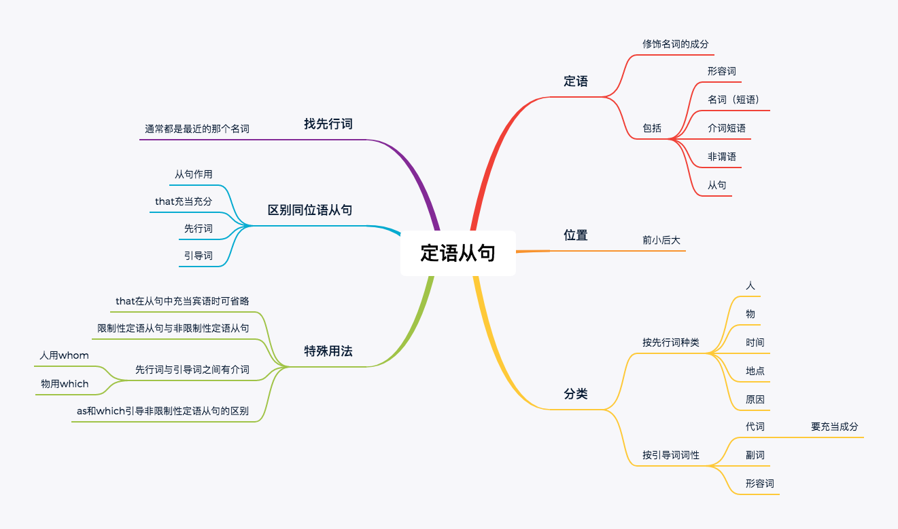

## 1. 定语

### 1.1 定语定义

`修饰名词的成分`

>  ...的+名词，...的 就是修饰这个名词（短语）的定语成分。

### 1.2 定语成分

- `形容词`作定语

  > The innocent nightingale(夜莺) died.

  > That nightingale (brave and innocent) died.

- `名词（短语）`作定语

  > The nightingale's singing can mke the rose bloom.:x:

  > The singing (of the nightingale) can make the rose bloom.

- `介词短语`作定语

  > The nightingale (out of the window) heard the sighs of th youngster.

- `非谓语`作定语

  > The (singing) nightingale lost his life

- 从句作定语

## 2. 定语的位置

前小后大：

- 一个单词修饰名词时，通常放在名词前
- 多个单词修饰名词时， 通常放在名词后

### 2.1 练习:memo:

这是一个关于夜莺和玫瑰的故事。

> This is a fiction(story) about a nightingale and a rose.

那个懂爱的年轻人离开了王子的舞会。

> The youngster grasping(understanding) romance left the party of the prince.

被拒绝的那个男生看起来很可怜。

> The rejected boy looks pitiful.
>
> 过去分词修饰名词即使只有一个名词，通常放在名词后
>
> The boy rejected looks pitiful.

我有重要的事情告诉你。

> I have something important to tell you.
>
> 形容词修饰不定代词，即使只有一个，通常放在后面。

## 3. 定语从句

### 3.1 构成

`n（先行词） + 引导词 + 句子`

### 3.2 引导词

引导词(8个)按照先行词的种类分的类，一共分为5类。

- 人：`who, whom(只充当宾语), whose`(that 主要指物)
- 物：that, which, `whose`
- 时间：that, which, when
- 地点：that, which, where
- 原因：that, which, why

例子

>  I will never forget the day <u>when</u>  I met you. 
>
> 不用`that`：that是个代词，要充当成分，名词性从句中不充当成分。
> I will never forget the day <u>that</u>  we spent. 

> You had better have some reson <u>why</u>  you are late.
>
> You had better have some reson <u>that</u>  sounds perfect.

`先行词+引导词在从句的成分` 决定引导词的用法。

新分类标准——`引导词本身的词性`

- 代词，充当主语或宾语的成分：`who, whom, that, which`
- 副词，不充当任何充分：`where, when, why`
- 形容词，修饰离他最近的名词：`whose`

### 3.3 练习:memo:

夜莺用生命换来的玫瑰花被扔掉了。

> The rose <u>that</u> [the nightingale exchanged with his life] was discarded.
>
> exchanged 后面缺宾语

这些圆顶的建筑物看起来很漂亮。

> The buildings  <u>whose</u> [roofts are round] looks beautiful.

成功属于有梦想的人已经被无数个事实所证明了。

> It has been validated(proved) by numerous facts that glories belong to those <u>who</u> [have dreams].

穿自己的鞋不仅方便，而且还确保了一点——不用管别人的感受。

> Wearing my own shoes proves not only convenient but also ensures a point <u>that</u> [the feelings of others can be ignored].

问题的关键是谁应该为道德的沦丧负责呢？

> The point of the issue seems <u>who</u> [should be responsible for the decline of ethics].

外表看起来的邋遢的他其实内心很高尚。

> He <u>whose</u> [appearance looks indecent] proves noble in his mind.

那些全力以赴去实现梦想的人，即使没有成功也不会感到遗憾，这很重要！

> It seems indispensable that those <u>who</u> [ spare no efforts to realize their dreams] never feel pitiful although they fail to achieve glories.

上课不集中精力而又希望通过考试的学生往往结果差强人意。

> Students <u>who</u> [fail to concentrte in class but wish to pass examinations smoothly] tend to find that the consequence proves less impressive(bad).

## 4. 特殊用法

- `that`做引导词的省略

  that在从句中充当宾语

  > I enjoy the book (that) my mother bought for me.

  看到两个名词或者代词直接放在一起，通常都是省略了that的定语从句。

  

- 区别限制和非限制性定语从句

  - 非限制性定语从句相当于插入语，可以完全不看

- 先行词和引导词之间有介词

  - 人只用whom
  - 物只用which

  > - He is the man <u>who/whom</u> we should learn from.
  >
  > - He is the man from <u>whom</u> we should learn.

  > - I will never forget the day <u>when</u> I met you.
  >
  > - I will never forget the day on <u>which</u> I met you.

- 区别 `the same ... as`/ `the same .. that`

> - He is the same man as I love. `as:像`
>
> - He is the same man that I love. `that:是`

- as 和 which引导的非限制性定语从句

  as和which都可以修饰前面整个句子，但是，which只能放在句子后面，as可前可后。

  > He enjoys talking with young ladies, <u>which/as</u> drives me crazy. 
  >
  > <u>As</u> drives me crazy, he enjoys talking with young ladies.

- which和that的区别

## 5. 区别定语从句与同位语从句

> I have a dream that sounds funnny. 定语
>
> I have a dream that I will become a rich lady. 同位语

### 5.1 同

结构都为：`先行词+引导词+句子`

### 5.2 不同

| 区分依据         | 定语从句 | 同位语从句 |
| ---------------- | -------- | ---------- |
| 从句作用         | 用来修饰 | 用来解释   |
| that是否充当成分 | 是       | 否         |
| 先行词           | 所有名词 | 抽象名词   |
| 引导词           | 8类      | `that`     |

## 6. 定语从句至难点

寻找先行词（必须读懂这句话）

- 最近的那个名词:m:
- 并列的几个名词
- 前面的从句
- 前面的句子
- 先行词和引导词被隔开

> When someone abandons you, he is the (one) <u>who</u> should get loss.

> For workers it can mean (an end to the security, benefits and sense of importance) <u>that</u> came from being a loyal employee.

> The Greeks assumed (that the structure of language had some connection with the peocess of thought), <u>which</u> took root in Europe long before people realized how diverse languages could be.

> (My husband enjoys talking with other ladies), <u>which</u> really gets me go mad.

> There exists no (language or dialect) in the world <u>that</u> cannot convey complex ideas.

## 7.应用

见到名词就可以加定语。

> Pets (whichs look cute as well as healthy) can reduce loneliness (of senior citizens without any children). 

> Reading books (which keep beneficial to our physical and mental heath) can add knowledge of all children and adults.

