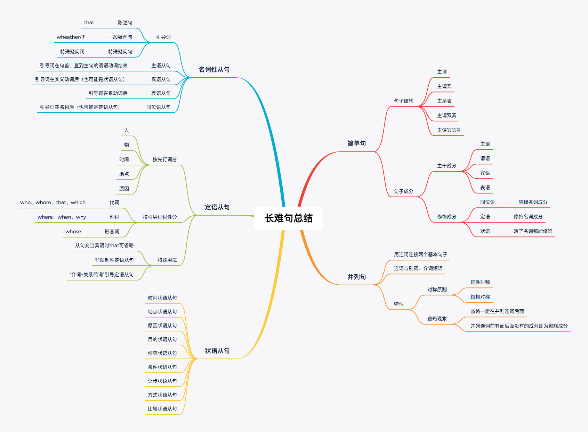

### 1. 长难句公式

（状/定），`主`（定/状/同/插）+`谓` +  `宾/表`（定/状/同）

### 2. 系动词

| be         |                                 |
| ---------- | ------------------------------- |
| 感官       | look、smell、sound、feel、taste |
| 变化       | become、get、turn、grow、fall   |
| 保持       | keep、stay、remain、stand       |
| 表象       | seem、appear                    |
| 终止或结果 | prove                           |

有些系动词还可以做实义动词

- get：得到
- turn：转动
- grow：成长、发展、种植
- fall：下降
- keep：继续、饲养
- stay：逗留

###  连词与逻辑关系词

逻辑关系词包括副词与介词短语

| 关系 | 连词                                                         | 副词                                                         | 介词短语                          |
| ---- | ------------------------------------------------------------ | ------------------------------------------------------------ | --------------------------------- |
| 平行 | and, not only...but also..., both...and..., eighter...or, neither...nor... | similarly,  equalily, likewise                               | at the same time, in the meantime |
| 转折 | but, while, yet, wheras                                      | however, nervertheless, conversely, contrarily,unexpectedly,unfortunately | on the contrary, in/by contrast   |
| 选择 | or, whether...or...                                          | alternatively                                                |                                   |
| 因果 | for, so                                                      | therefore, thus, consequently                                | as a result, as a consequence     |
| 递进 | then                                                         | besides, additionally, subsequently                          | in addition                       |

连词与副词、介词短语的区别

- 连词前面有无逗号均可

- 其他逻辑关系词前面要么用句号要么前面加连词`and`

  

### 4.句子所有成分

- 主干成分：主语、谓语、宾语、表语
- 修饰成分：同位语、定语、状语、补语（相当于定语）

| 主语   | 谓语     | 宾语   | 表语     | 同位语 | 定语     | 状语     |
| ------ | -------- | ------ | -------- | ------ | -------- | -------- |
| 名词   | 实义动词 | 名词   | 名词     | 名词   | 名词     | 副词     |
| 代词   | 系动词   | 代词   | 代词     | 代词   | 代词     | 介词短语 |
| 非谓语 |          | 非谓语 | 非谓语   | 非谓语 | 非谓语   | 非谓语   |
| 从句   |          | 从句   | 从句     | 从句   | 从句     | 从句     |
|        |          |        | 形容词   |        | 形容词   |          |
|        |          |        | 介词短语 |        | 介词短语 |          |

- 非谓语除了谓语都可以充当
- 主语、宾语、同位语成分相同
- 表语和定语成分相同

### 5. 限制性定语从句与非限制性定语从句的区别

| 区别                           | 限制性定语从句               | 非限制性定语                                   |
| ------------------------------ | ---------------------------- | ---------------------------------------------- |
| 与先行词关系                   | 关系紧密，删除后影响句子意思 | 关系疏松，起补充说明作用，删除后不影响主句意思 |
| 逗号                           | 无                           | 有                                             |
| 是否可用that作用               | 是                           | 否                                             |
| which/whom在从句中作宾语的省略 | 可省略                       | 不可省略                                       |
| 是否能修饰句子                 | 是                           | 否                                             |
| 翻译区别                       | 常译作定语                   | 常译作两个独立句子                             |

### 6. 状语从句的引导词

| 分类     | 普通引导词                                                   | 特殊引导词                                                   |
| -------- | ------------------------------------------------------------ | ------------------------------------------------------------ |
| 时间     | when、as、while（在...期间）、once（一旦）、as...soon...as、before、after、since、not...until（直到...才）、until/till | Immediately、directly、no sooner than、hardly ...when、scarcely...when（以上意思都是 一...就...）the moment、every time、the day、the instant |
| 地点状语 | where                                                        | where、anywhere、anywhere                                    |
| 原因     | because、since、as、for                                      | seeing that、now that、in that（以上均为 由于）、considering that、given that（考虑到）【注意： because of、due to、owing to、thanks to、 for the sake of、as a result of、虽然也翻译为因为但是它们后面只能加名词】 |
| 目的     | so that、in order that                                       | to、in order to、so as to                                    |
| 结果     | so that、so...that、such...that                              | to the degree that、to the extent that、to such a degree that |
| 条件     | If、unless（=if not）                                        | as/so long as（只要）、only if（只要）、providing/provided that（假如）、supporting（that）（假如）、in case that（以防），on condition that（如果） |
| 让步     | though、although、even if（即使）、even though               | as、while（虽然，常置于句首）、no matter...（无论）、in spite of the fact that（虽然）、wherever、whatever、however、whichever |
| 方式     | as、as if、as though（好像）                                 | by、through、in...way、in...manner、the way（方式）          |
| 比较     | as、than                                                     | the more...the more...、more than、more...than...、not so much...as... |

 

