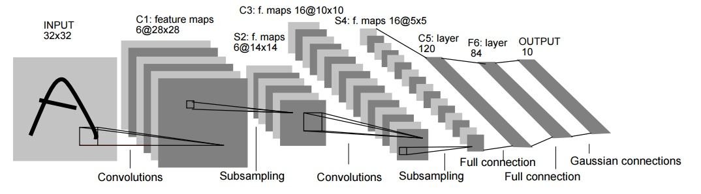
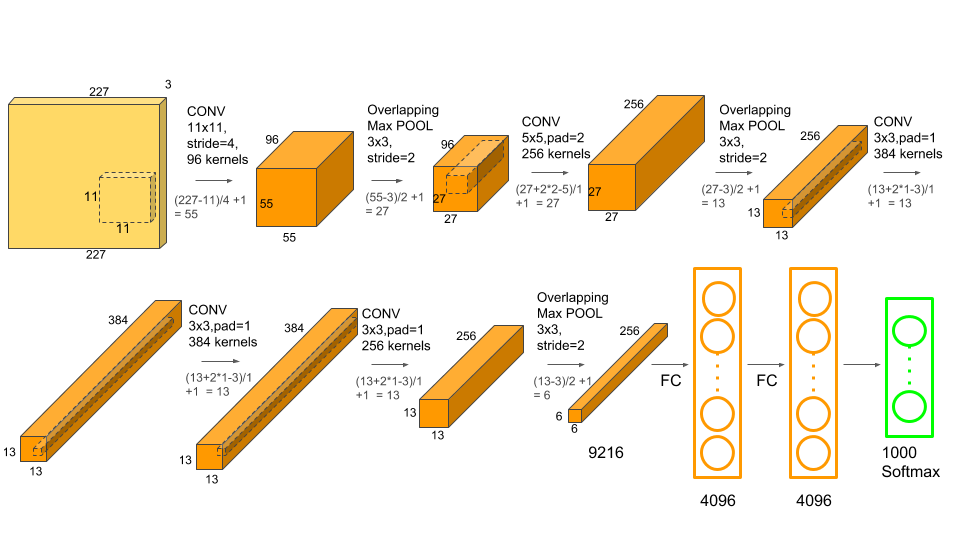
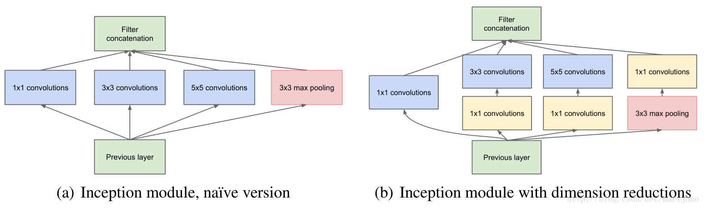
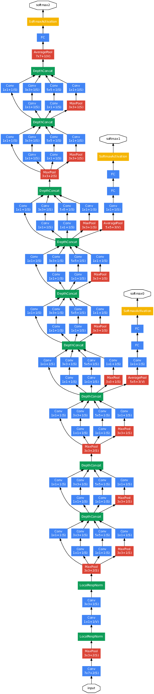
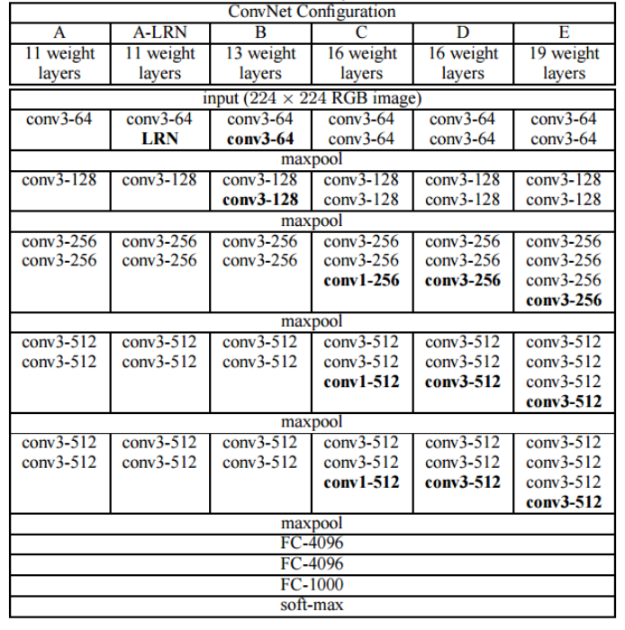

# CNN

## 1. LeNet



```python
class LeNet(nn.Module):
    def __init__(self):
        super().__init__()
        self.conv = nn.Sequential(
            nn.Conv2d(1, 6, 5), # in_channels, out_channels, kernel_size
            nn.Sigmoid(),
            nn.MaxPool2d(2, 2),
            nn.Conv2d(6, 16, 5),
            nn.Sigmoid(),
            nn.MaxPool2d(2, 2)
        )
        self.fc = nn.Sequential(
            nn.Linear(16*4*4, 120),
            nn.Sigmoid(),
            nn.Linear(120, 84),
            nn.Sigmoid(),
            nn.Linear(84, 10)
        )
    def forward(self, img):
        feature = self.conv(img)
        output = self.fc(feature.view(img.shape[0], -1))
        return output
    
def test_lenet():
    x = torch.randn(64, 1, 32, 32)
    model = LeNet()
    return model(x)
```


## 2. AlexNet



[origin picture of alexnet](https://pic2.zhimg.com/80/v2-3f5a7ab9bcb15004d5a08fdf71e6a775_720w.jpg)

```python
class AlexNet(nn.Module):
    def __init__(self):
        super().__init__()
        self.conv = nn.Sequential(
            nn.Conv2d(in_channels=1, out_channels=96, kernel_size=(11, 11), stride=4),
            nn.ReLU(),
            nn.MaxPool2d(kernel_size=3, stride=2),
            nn.Conv2d(in_channels=96, out_channels=256, kernel_size=(5, 5), padding=2),
            nn.ReLU(),
            nn.MaxPool2d(kernel_size=3, stride=2),
            nn.Conv2d(in_channels=256, out_channels=384, kernel_size=(3, 3), padding=1),
            nn.ReLU(),
            nn.Conv2d(in_channels=384, out_channels=384, kernel_size=(3, 3), padding=1),
            nn.ReLU(),
            nn.Conv2d(in_channels=384, out_channels=256, kernel_size=(3, 3), padding=1),
            nn.ReLU(),
            nn.MaxPool2d(kernel_size=3, stride=2)
        )

        self.fc = nn.Sequential(
            nn.Linear(256*5*5, 4096),
            nn.ReLU(),
            nn.Dropout(0.5),
            nn.Linear(4096, 4096),
            nn.ReLU(),
            nn.Dropout(0.5),
            nn.Linear(4096, 10)
        )

    def forward(self, img):
        features = self.conv(img)
        features = features.view(img.shape[0], -1)
        output = self.fc(features)
        return output
```


## 3. GoogLeNet





[origin picture of googlenet](https://miro.medium.com/max/513/1*i_FcDQfQvNCCKkj5TI_IhA.png)

```python
class Inception(nn.Module):
    def __init__(self, in_channels, c1, c2, c3, c4):
        super().__init__()
        self.p1_1 = nn.Conv2d(in_channels=in_channels, out_channels=c1, kernel_size=1)
        self.p2_1 = nn.Conv2d(in_channels=in_channels, out_channels=c2[0], kernel_size=1)
        self.p2_2 = nn.Conv2d(in_channels=c2[0], out_channels=c2[1], kernel_size=3, padding=1)
        self.p3_1 = nn.Conv2d(in_channels=in_channels, out_channels=c3[0], kernel_size=1)
        self.p3_2 = nn.Conv2d(in_channels=c3[0], out_channels=c3[1], kernel_size=5, padding=2)
        self.p4_1 = nn.MaxPool2d(kernel_size=3, stride=1, padding=1)
        self.p4_2 = nn.Conv2d(in_channels=in_channels, out_channels=c4, kernel_size=1)


    def forward(self, x):
        p1 = F.relu(self.p1_1(x))
        p2 = F.relu(self.p2_2(F.relu(self.p2_1(x))))
        p3 = F.relu(self.p3_2(F.relu(self.p3_1(x))))
        p4 = F.relu(self.p4_2(F.relu(self.p4_1(x))))
        return torch.cat((p1, p2, p3, p4), dim=1)  # dim 1 is out channels


b1 = nn.Sequential(
    nn.Conv2d(in_channels=1, out_channels=64, kernel_size=7, stride=2, padding=3),
    nn.ReLU(),
    nn.MaxPool2d(kernel_size=3, stride=2, padding=1)
)

b2 = nn.Sequential(
    nn.Conv2d(in_channels=64, out_channels=192, kernel_size=3, stride=1, padding=1),
    nn.ReLU(),
    nn.MaxPool2d(kernel_size=3, stride=2, padding=1)
)

b3 = nn.Sequential(
    Inception(192, 64, (96, 128), (16, 32), 32),
    Inception(256, 128, (128, 192), (32, 96), 64),
    nn.MaxPool2d(kernel_size=3, stride=2, padding=1)
)

b4 = nn.Sequential(
    Inception(480, 192, (96, 208), (16, 48), 64),
    Inception(512, 160, (112, 224), (24, 64), 64),
    Inception(512, 128, (128, 256), (24, 64), 64),
    Inception(512, 112, (144, 288), (32, 64), 64),
    Inception(528, 256, (160, 320), (32, 128), 128),
    nn.MaxPool2d(kernel_size=3, stride=2, padding=1)
)

b5 = nn.Sequential(
    Inception(832, 256, (160, 320), (32, 128), 128),
    Inception(832, 384, (192, 384), (48, 128), 128),
    nn.AvgPool2d(kernel_size=7, stride=1, padding=3)
)

net = nn.Sequential(
    b1, b2, b3, b4, b5,
    FlattenLayer(),
    nn.Dropout(0.4),
    nn.Linear(1024*3*3, 10)
)
```


## 4. VGG



```python
def vgg_block(num_convs, in_channels, out_channels):
    block = []
    for i in range(num_convs):
        if i == 0:
            block.append(nn.Conv2d(in_channels, out_channels, kernel_size=3, padding=1))
        else:
            block.append(nn.Conv2d(out_channels, out_channels, kernel_size=3, padding=1))
        block.append(nn.ReLU())
    block.append(nn.MaxPool2d(kernel_size=2, stride=2))
    return nn.Sequential(*block)

def vgg_11(params, fc_features, num_hiddens=4096):
    net = nn.Sequential()
    for i, (num_convs, in_channels, out_channels) in enumerate(params):
        net.add_module(
            "vgg_block_{}".format(i), nn.Sequential(vgg_block(num_convs, in_channels, out_channels))
        )
    net.add_module(
        "fc", nn.Sequential(
            FlattenLayer(),
            nn.Linear(fc_features, num_hiddens),
            nn.ReLU(),
            nn.Dropout(0.5),
            nn.Linear(num_hiddens, num_hiddens),
            nn.ReLU(),
            nn.Dropout(0.5),
            nn.Linear(num_hiddens, 10)
        )
    )

    return net

ratio = 8
small_params = [
    [1, 1, 64 // ratio],
    [1, 64  // ratio, 128 // ratio],
    [2, 128 // ratio, 256 // ratio],
    [2, 256 // ratio, 512 // ratio],
    [2, 512 // ratio, 512 // ratio]
]
fc_features = 512 * 7 * 7
num_hiddens = 4096
net = vgg(small_params, fc_features // ratio, num_hiddens // ratio)
```


## 5. ResNet


```python
"""Residual block"""
class Residual(nn.Module):
    def __init__(self, in_channels, out_channels, use_1x1conv=False, stride=1):
        super().__init__()
        self.conv1 = nn.Conv2d(in_channels, out_channels, kernel_size=3, padding=1, stride=stride)
        self.conv2 = nn.Conv2d(out_channels, out_channels, kernel_size=3, padding=1)
        if use_1x1conv:
            self.conv3 = nn.Conv2d(in_channels, out_channels, kernel_size=1, stride=stride)
        else:
            self.conv3 = None
        self.bn1 = nn.BatchNorm2d(out_channels)
        self.bn2 = nn.BatchNorm2d(out_channels)

    def forward(self, X):
        Y = F.relu(self.bn1(self.conv1(X)))
        Y = self.bn2(self.conv2(Y))
        if self.conv3:
            X = self.conv3(X)
        return F.relu(Y + X)


def resnet_block(in_channels, out_channels, num_residuals):
    blk = [Residual(in_channels, out_channels, use_1x1conv=True, stride=2)]
    for i in range(1, num_residuals):
        blk.append(Residual(out_channels, out_channels))
    return nn.Sequential(*blk)


def first_block(in_channels, out_channels, num_residuals):
    blk = []
    for i in range(num_residuals):
        blk.append(Residual(out_channels, out_channels))
    return nn.Sequential(*blk)


def resnet():
    net = nn.Sequential(
        nn.Conv2d(in_channels=1, out_channels=64, kernel_size=7, stride=2, padding=3),
        nn.BatchNorm2d(64),
        nn.ReLU(),
        nn.MaxPool2d(kernel_size=3, stride=2, padding=1)
    )
    net.add_module("resnet_block1", first_block(64, 64, 2))
    net.add_module("resnet_block2", resnet_block(64, 128, 2))
    net.add_module("resnet_block3", resnet_block(128, 256, 2))
    net.add_module("resnet_block4", resnet_block(256, 512, 2))
    net.add_module("global_avg_pool",GlobalAvgPool2d())
    net.add_module("fc", nn.Sequential(FlattenLayer(), nn.Dropout(0.4), nn.Linear(512, 10)))
    return net
```


## 6. DenseNet


```python
def conv_block(in_channels, out_channels):
    blk = nn.Sequential(
        nn.BatchNorm2d(in_channels),
        nn.ReLU(),
        nn.Conv2d(in_channels, out_channels, kernel_size=3, padding=1)
    )
    return blk


class DenseBlock(nn.Module):
    def __init__(self, num_convs, in_channels, out_channels):
        super().__init__()
        net = []
        for i in range(num_convs):
            in_c = in_channels + i * out_channels
            net.append(conv_block(in_c, out_channels))
        self.net = nn.ModuleList(net)
        self.out_channels = in_channels + num_convs * out_channels

    def forward(self, X):
        for blk in self.net:
            Y = blk(X)
            X = torch.cat((X, Y), dim=1)
        return X


"""change the out channels,  reduce width and height"""
def TransitionBlock(in_channels, out_channels):
    blk = nn.Sequential(
        nn.BatchNorm2d(in_channels),
        nn.ReLU(),
        nn.Conv2d(in_channels=in_channels, out_channels=out_channels, kernel_size=1),
        nn.MaxPool2d(kernel_size=2, stride=2)
    )
    return blk

def fisrt_block():
    blk = nn.Sequential(
        nn.Conv2d(1, 64, kernel_size=7, stride=2, padding=3),
        nn.BatchNorm2d(64),
        nn.ReLU(),
        nn.MaxPool2d(kernel_size=3, stride=2, padding=1))
    return blk


def DenseNet():
    net = nn.Sequential()
    net.add_module("FirstBlock", fisrt_block())
    num_channels, growth_rate = 64, 32
    num_convs_in_dense_blocks = [4, 4, 4, 4]
    for i, num_convs in enumerate(num_convs_in_dense_blocks):
        Dense_blk = DenseBlock(num_convs, num_channels, growth_rate)
        net.add_module("DenseBlock_{}".format(i), Dense_blk)
        num_channels = Dense_blk.out_channels # last channels

        if i != len(num_convs_in_dense_blocks) - 1:
            net.add_module("TransitionBlock_{}".format(i), TransitionBlock(num_channels, num_channels // 2))
            num_channels = num_channels // 2

    net.add_module("LastModule",nn.Sequential(
        nn.BatchNorm2d(num_channels),
        nn.ReLU(),
        GlobalAvgPool2d(),
        FlattenLayer(),
        nn.Linear(num_channels, 10)
        )
    )
    return net
```

