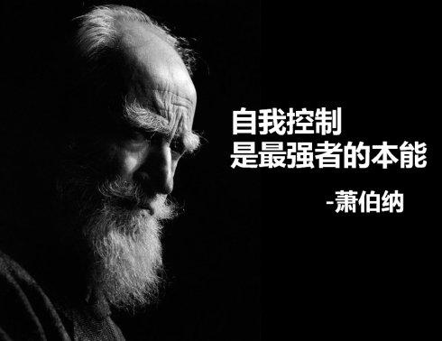

# Hichens's Winter Shedule

## 目标
- 发**一篇**论文

- 期末考试考第一

- 读完**10本**课外书

- 读完CV方向论文 **40篇**

- 利用pytorch熟练的复现论文

- 六级 **600**

- 体育满分： 1000米 3分20秒， 跳远2米8， 引体向上20个

  

## 时间安排表

| 时间 |  事件    |
| :-------------------- | ---- |
| 7：00 - 7：20       |起床（起不来借助音乐）      |
| 7：20 - 7：40      |吃早饭      |
| 7：40 - 8：00      |快速复习昨日所学      |
| 8：00 - 8：30         |   单日记单词，双日听听力   |
| 8：30 - 8：50    |休息， 并计划好今日安排（有课就是第一节课下课）      |
| 9：00 - 11：40   | 学习时间--自由安排     |
| 11：40 - 12：10  | 午饭     |
| 12：10 - 13：00   | 阅读时间     |
| 13：00 - 13：30 |  午休时间    |
| 13：50 - 17：40 | 学习时间--自由安排     |
| 17：40 - 18：10 | 晚饭     |
| 18：10 - 19：00 | 阅读或者写读书笔记  |
| 19：00 - 19：50 | 娱乐时间--自由安排  |
| 20：00 - 21：30 | 学习时间--自由安排  |
| 21：40 - 22：30 | 运动健身时间， 单日健身，双日跑步  |
| 22：30 - 23：00 | 洗澡休息  |
| 23：00 - 23：20 | 快速复习今日所学  |
| 23：20 - 24：00  |阅读或者看会儿视频准备睡觉  |

注：
- 一周执行该表至少**六天**
- 一周至少看完**一本**课外书
- 每当心情沮丧时看励志书籍， 详情看励志书单
- 经常总结
- 此计划表可适当调整

## 饮食安排
| 时间 |  事件    |
| :-------------------- | ---- |
| 早 |  单日吃包子，双日吃饼或者面包， 周日吃面或者粉  |
| 中午 | 按星期： 中心一楼、中心二楼、大西北、兴业苑、樱花、延生、莘莘  |
| 晚上 |  宿舍：燕麦，面包，鸡蛋，鸡胸肉（一周两次），水果    |

注：
- 一周出去吃的次数不超过**两次**
- 多吃素菜和水果
- 少吃甚至不吃垃圾油炸食品

## 附录
### 励志书单
- 《你只是自认为很努力》
- 《哈佛凌晨四点半》
- 《精进》
- 《慢慢来，一切都来得及》
- 《成为：米歇尔·奥巴马自传》
- 《你的情商，决定你的人生高度》
- 《别在吃苦的年纪选择安逸》
- 《在绝望中寻找希望》
- 《做人要学曾国藩 做事要学胡雪岩》
- 《没有一种运气是偶然》
- 《这才是我要的工作：好用到不可思议的人生进击指南》
- 《我喜欢这个“功利”的世界》
- 《羊皮卷》
- 《自控：如何成为一个冷静智慧的人》
- 《你的努力,终将成就无可替代的自己》
- 《将来的你 ,一定会感谢现在拼命的自己》
- 《少有人走的路》
- 《当你的才华还撑不起你的梦想时》
- 《我们都曾受过伤，却有了更好的人生》
- 《精进自己：让青春更有力量》
- 《伟大的励志书》
- 《品格的力量》
- 《慢慢来，一切都来得及》
- 《做内心强大的女人：卡耐基写给女人的心灵成长书》
- 《女人的资本》
- 《正能量:做个内心强大的女人》
- 《淡定：如何成为一个从容优雅的人》
- 《一生的忠告》
- 《日清日高：从挫折走向成功》
- 《精进自己：让青春更有力量》
- 《成功学原理》

### 娱乐方式
- 聊天
- 打游戏
- github搜寻有趣的项目|打开Chrome有趣收藏夹
- 练字 
- 素描
- 听音乐
- 看纪录片
- 刷剧
- 刷油管
...